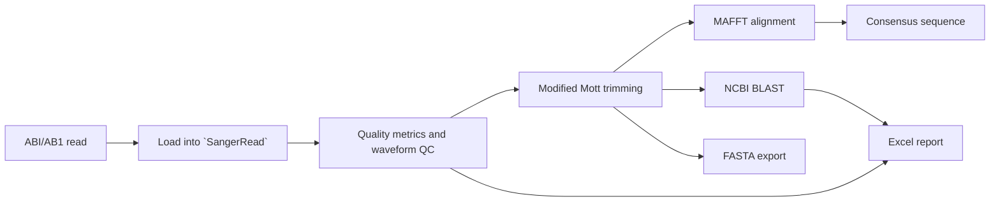

# SangerFlow

SangerFlow is a Python desktop application for inspecting and processing Sanger sequencing reads from ABI/AB1 chromatogram files. It brings together read loading, chromatogram viewing, quality control, quality-based trimming, MAFFT alignment, consensus generation, NCBI BLAST queries, and FASTA/Excel export.

The current production GUI is built with Tkinter. SangerFlow is intended for researchers working with DNA barcode and other Sanger sequencing workflows who need to move from raw chromatograms to reviewable sequence outputs.

> **Project status:** this repository is an active development project. The implementation is usable as a foundation, but automated test coverage and several workflow areas are still being stabilized. See [Current Status](docs/CURRENT_STATUS.md) before using it for production research decisions.

## What is implemented

- Read ABI/AB1 files into a shared `SangerRead` model.
- Extract base calls, Phred quality values, chromatogram traces, and peak positions.
- Calculate average quality, Q20/Q30 rates, HQ%, and waveform QC status.
- Trim reads with the Modified Mott algorithm.
- Display chromatograms and trim regions in a Tkinter GUI.
- Select reads, export selected FASTA sequences, and save/load selection state.
- Align trimmed reads with MAFFT and map alignment columns to chromatogram positions.
- Build majority-rule and quality-weighted consensus sequences.
- Submit sequence queries to NCBI BLAST and export BLAST summaries to Excel.
- Export FASTA, consensus FASTA, Excel reports, and merged FASTA files.

For the code-level architecture and data flow, see [Architecture](docs/Architecture.md).

## Planned or under consideration

The following are not presented as current features:

- A stabilized automated test suite and dependency cleanup.
- Read editing, undo/redo, and explicit forward/reverse read pairing.
- Project save/load workflows and reproducible analysis history.
- BOLD, ASAP, and ABGD integration.
- A production PySide6 GUI. The repository includes `test_gui.py`, but it is an experimental script rather than the production interface.
- Packaging and distribution improvements.

See [Roadmap](docs/Roadmap.md) for priorities, prerequisites, completion criteria, and risks.

## Screenshot placeholder

<!--
Add a screenshot here when a stable demonstration image is available.

Suggested location: docs/images/sangerflow-main-window.png
Suggested Markdown:

-->

## Requirements

SangerFlow requires:

- Python with Tkinter/Tcl-Tk support.
- [MAFFT](https://mafft.cbrc.jp/alignment/software/) installed and available as `mafft` on `PATH` for alignment.
- Network access for NCBI BLAST queries.

The Python runtime dependencies currently confirmed from the code are listed in [Current Status](docs/CURRENT_STATUS.md). The repository's `requirements.txt` currently does not declare every package imported by production code; the installation steps below account for that known gap without modifying dependency files.

## Installation

Clone the repository and create a virtual environment from the repository root:

```bash
git clone <repository-url>
cd SangerFlow

python -m venv .venv
.venv/bin/python -m pip install --upgrade pip
.venv/bin/python -m pip install -r requirements.txt
.venv/bin/python -m pip install openpyxl certifi
```

Verify that MAFFT is available:

```bash
mafft --version
```

`openpyxl` and `certifi` are installed explicitly because they are imported by the current production code but are not yet listed in `requirements.txt`. This is a documented current-state limitation, not a claim that the dependency definition has been corrected.

Platform-specific installation of Python, Tkinter, and MAFFT is outside the scope of this repository and should be completed before running the application.

## Running SangerFlow

### Desktop GUI

From the repository root:

```bash
python -m gui.app
```

Use the GUI to open a single `.ab1` file or a folder of `.ab1` files, inspect quality information and chromatograms, select reads, and start available alignment or BLAST workflows.

### Single-read command line workflow

```bash
python pipeline.py path/to/sample.ab1
```

The current script reads the AB1 file, reports quality values, trims the sequence, saves FASTA, submits a BLAST query, and writes BLAST reports. It requires network access for the BLAST stage.

### Folder-based scripts

```bash
python main.py
python batch_pipeline.py
```

Both scripts use the repository's `input/` directory and produce local output. They represent separate, partially overlapping batch workflows. Review [Workflow](docs/Workflow.md) and [Current Status](docs/CURRENT_STATUS.md) before relying on either in a routine analysis pipeline.

## Typical analysis flow



The exact data flow, module responsibilities, and external integrations are documented in [Architecture](docs/Architecture.md).

## Documentation

- [Current Status](docs/CURRENT_STATUS.md) — verified implementation status, dependencies, test state, known issues, and documentation/code discrepancies.
- [Architecture](docs/Architecture.md) — module responsibilities, data flow, GUI/core boundaries, and MAFFT/BLAST integration.
- [Workflow](docs/Workflow.md) — setup, launch, usage flow, common errors, and basic development checks.
- [Roadmap](docs/Roadmap.md) — clearly labeled plans and future candidates.
- [Development Rules](docs/DEVELOPMENT_RULES.md) — contribution and maintenance rules, including scientific-data safeguards.
- [AI Agent Instructions](AGENTS.md) — focused guidance for AI-assisted development.

## Scientific-use note

SangerFlow provides computational support for sequence review and analysis. Quality thresholds, trimming decisions, consensus interpretation, species identification, and downstream biological conclusions should be reviewed by qualified researchers. Network-derived BLAST results should not be treated as a final taxonomic determination without appropriate scientific validation.

## Contributing

Before proposing a change, read [Development Rules](docs/DEVELOPMENT_RULES.md), inspect the current Git working tree, and keep changes small and focused. Changes to scientific logic or the `SangerRead` data model should document their rationale, expected output impact, and verification method.
