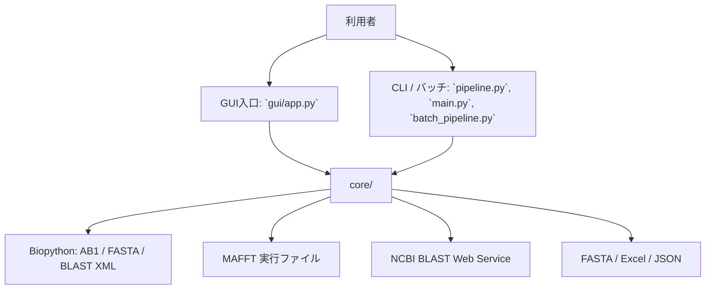
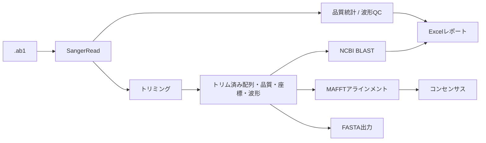

# SangerFlow アーキテクチャ

## この文書の目的

この文書は、現在のリポジトリ内のPythonコードを唯一の事実基準として、SangerFlowの実装済み構成、データの流れ、外部連携、および結合の強い箇所を記録する。READMEや既存文書は補助資料であり、コードと矛盾する場合はコードを正とする。確認された不整合は[CURRENT_STATUS.md](CURRENT_STATUS.md)に集約する。将来の構想は実装事実と区別して[ロードマップ](Roadmap.md)に記録する。

## 目的と範囲

SangerFlowは、ABI/AB1クロマトグラムファイルを対象に、配列・品質値・波形を読み込み、品質確認、トリミング、アラインメント、コンセンサス、BLAST、FASTA/Excel出力を行うデスクトップ向けPythonアプリケーションである。

本番GUIと実験用GUIの現在の区分は、可変情報として[CURRENT_STATUS.md](CURRENT_STATUS.md)を参照する。

## システム全体



依存方向は実装上、主に `gui/` → `core/` である。`core/` から `gui/` をインポートする箇所は確認されていない。外部連携は`core/mafft.py`、`core/chromatogram_alignment.py`、`core/blast.py`に置かれている。

## ディレクトリ構造

```text
SangerFlow/
├── core/                 # 解析、I/O、外部連携、データモデル
├── gui/                  # Tkinterのウィンドウ、パネル、Canvas
├── config/               # QCしきい値
├── docs/                 # プロジェクト文書
├── tests/                # 自動テストの配置先
├── input/                # ローカル入力用（Git ignore）
├── output/               # ローカル生成物（Git ignore設定だが一部追跡済み）
├── main.py               # フォルダ処理の入口
├── pipeline.py           # 1 AB1ファイル処理の入口
├── batch_pipeline.py     # 別実装のバッチ入口
└── requirements.txt
```

## 主要モジュール

| 領域 | 主なファイル | 確認できた責務 |
|---|---|---|
| データモデル | `core/models.py` | `SangerRead` の定義 |
| AB1読込 | `core/ab1_reader.py` | 配列、Phred品質値、4チャネル波形、ピーク位置の取得 |
| QC・トリミング | `core/quality.py`、`core/waveform_qc.py`、`core/trimming.py` | 基本品質統計、しきい値判定、Modified Mottトリミング |
| アラインメント | `core/mafft.py`、`core/chromatogram_alignment.py`、`core/alignment_mapper.py` | MAFFT実行、整列列とトレース位置の対応付け |
| コンセンサス | `core/consensus.py` | 多数決・品質加重コンセンサス |
| BLAST | `core/blast.py`、`core/blast_controller.py`、`core/blast_exporter.py` | NCBI検索、集計、Excel出力 |
| 出力 | `core/exporter.py`、`core/report.py`、`core/merge.py` | FASTA、Excel、FASTA結合 |
| GUI | `gui/main_window.py`、各種Canvas/Window | 読込、選択、表示、操作の仲介 |

詳細なデータモデルは[DataModel.md](DataModel.md)、既存のCore説明は[Core.md](Core.md)、GUI構成は[GUI.md](GUI.md)を参照する。

## `SangerRead` とデータフロー

`core/models.py` の `SangerRead` は、`filename`、`sequence`、`quality`、`traces`、`base_positions` を持つ。トリミング後には同じオブジェクトへ `trim_start`、`trim_end`、`trimmed_sequence`、`trimmed_quality`、`trimmed_base_positions`、`trimmed_traces` が設定される。



`SangerRead` のrawフィールドは読込後に直接置換されない一方、派生状態は同一オブジェクトに可変で追加される。これは現在の実装事実であり、将来の不変データモデルへの移行は[ロードマップ](Roadmap.md)上の計画または検討候補である。

## 処理フロー

### AB1、QC、トリミング、出力

`core/pipeline.py` の `process_file()` は、`read_ab1()`、`waveform_qc()`、`quality_report()`、`trim_sequence()`、`save_fasta()`、`blast_sequence()` を順に呼ぶ。QCが`FAIL`の場合、およびトリム後配列が100 bp未満の場合は、その後のBLASTを行わず結果辞書を返す。

`core/sequence_loader.py` の `load_ab1_file()` はGUIの読込に使われ、トリミングと品質統計の設定後に `SangerRead` を返す。

### アラインメントとコンセンサス

`core/chromatogram_alignment.py` の `align_reads()` は、トリム済み配列を標準入力としてMAFFTへ渡し、Biopythonの`MultipleSeqAlignment`として読み込む。`core/alignment_mapper.py` はアラインメント列をトリム後ピーク位置へ対応付ける。`core/consensus.py` には多数決の `build_consensus()` と品質加重の `build_quality_consensus()` がある。

### BLAST

`core/blast.py` の `blast_sequence()` はBiopythonの `NCBIWWW.qblast()` を使い、NCBI BLASTへネットワーク要求を送る。結果XMLから種名、identity、coverage、alignment length、E-value、accessionを抽出する。ネットワーク可用性とNCBI側の応答に依存する。

## GUIとCLI

- GUI入口は `gui/app.py` の `main()` で、`MainWindow` を作成する。
- `pipeline.py` はコマンドライン引数で1つのAB1ファイルを受け取る。
- `main.py` は既定の `input/` を対象に `core.pipeline.process_folder()` を呼ぶ。
- `batch_pipeline.py` も既定の `input/` を対象に別実装のバッチ処理を持つ。

これらの入口には処理の重複がある。特にExcelサマリ作成は `batch_pipeline.py` と `core/report.py` にあり、AB1→QC→トリミング→BLASTのオーケストレーションも複数箇所に存在する。

## 実装上確認された結合・重複

- `gui/main_window.py` は読込、BLAST、アラインメント、選択、ビュー更新をまとめて扱う中心コントローラである。
- `gui/main_window.py` の `alignment_clicked` は同名定義が2つあり、後の定義が有効である。前の定義は実行時には上書きされる。
- `gui/quality_panel.py` は一時FASTA作成とMAFFT呼出しを直接行う。
- `core/chromatogram_alignment.py` と `core/mafft.py` はどちらもMAFFT実行を扱う。
- `main.py`、`pipeline.py`、`batch_pipeline.py`、`core/pipeline.py` に処理入口または近いオーケストレーションが分散している。

これらは現状説明であり、統合・再設計は確定事項ではない。改善の候補は[Roadmap.md](Roadmap.md)に「計画」または「検討候補」として記載する。可変のバージョン、依存関係、ブランチ、テスト状態は重複して記載せず、[CURRENT_STATUS.md](CURRENT_STATUS.md)を参照する。

## 関連文書

- [CURRENT_STATUS.md](CURRENT_STATUS.md)
- [Roadmap.md](Roadmap.md)
- [Workflow.md](Workflow.md)
- [DEVELOPMENT_RULES.md](DEVELOPMENT_RULES.md)
- [PAIR_AND_SINGLE_WORKFLOW_DESIGN.md](PAIR_AND_SINGLE_WORKFLOW_DESIGN.md) — Forward/Reverse pair assemblyとsingle-read workflowの設計提案
- [PAIR_ASSEMBLY_ALGORITHM_DESIGN.md](PAIR_ASSEMBLY_ALGORITHM_DESIGN.md) — CAP3非依存のpair assemblyアルゴリズム設計提案
- [AGENTS.md](../AGENTS.md)
