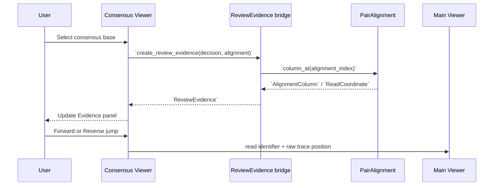
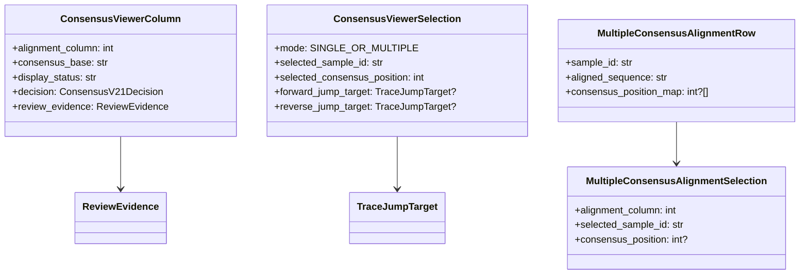

# Consensus Viewer 設計

## この文書の目的

この文書は、SangerFlowにおけるConsensus Viewerの役割、表示mode、既存Main Viewerとの座標接続、および将来のreview workflowを定義する。Consensus Viewerは、単一sampleのForward/Reverse contigを確認する画面であると同時に、複数sampleのconsensus sequenceをalignmentして確認するreview interfaceである。

現在のコードを唯一の実装事実とする。`PairAlignment`、`ConsensusV21Decision`、`ReviewEvidence`、`TraceJumpTarget`、Main ViewerのCoordinate Inspectorは現在存在する。一方、Consensus Viewer本体、multiple consensus alignment mode、Main Viewerへの実際のjump接続、manual annotation、manual editは**未実装の提案**である。Consensus algorithm、Review Engine、GUI描画の既存動作を変更する仕様ではない。

pair consensusの責務は[CONSENSUS_V2_1_DESIGN.md](CONSENSUS_V2_1_DESIGN.md)、pair alignmentの座標契約は[PAIR_ALIGNMENT_MODEL_DESIGN.md](PAIR_ALIGNMENT_MODEL_DESIGN.md)、既存のread-level multiple alignmentは[Architecture.md](Architecture.md)、開発制約は[DEVELOPMENT_RULES.md](DEVELOPMENT_RULES.md)を参照する。

## 1. Consensus Viewerの再定義

Consensus Viewerは、次の二つを一つのreview interfaceで扱う**提案**である。

1. 同一sample内のForward/Reverseから作られたcontig / consensusを、根拠とchromatogram座標を含めて確認する。
2. 複数sampleのconsensus sequenceをmultiple sequence alignmentして、sample間の差異を確認する。

### 目的

- Contig結果とcolumnごとのevidenceを確認する。
- 複数sampleのconsensus sequenceを比較する。
- alignment上のvariable site、`N`、gap、低confidence候補を発見する。
- 必要なsingle consensus baseから元AB1 chromatogramへtraceabilityを保つ。

### 対象外

- chromatogram traceの描画。
- base calling、F/R pair alignment計算、multiple alignment計算そのものの実装。
- consensus algorithm、Review criteria、PASS / REVIEW / FAILの変更。
- automatic acceptance、automatic rejection。
- traceデータの複製保存。

## 2. Contig AssemblyとConsensus Alignmentの責務分離

F/R contig assemblyとmultiple consensus alignmentは、入力・目的・座標の意味が異なる処理である。同じ処理として扱ってはならない。

| 処理 | 入力 | 役割 | 主な出力 |
|---|---|---|---|
| Contig Assembly | 同一sampleのForward AB1、Reverse AB1 | 同一PCR産物由来の2 readを統合する。 | `PairAlignment`、per-base decision、sample consensus。 |
| Consensus Alignment | 複数sampleのconsensus sequence | sample間のsequence差異を比較する。 | multiple consensus alignment、alignment column、variable site。 |

```text
AB1 Forward + AB1 Reverse
    -> F/R Contig Assembly
    -> Sample Consensus
    -> Multiple Consensus Alignment
    -> Downstream analysis
```

Contig Assemblyは同一sample内部のread evidenceを扱う。Consensus Alignmentはsample間比較を扱う。後者のalignment columnから元AB1へ戻る場合は、まずsample consensusのbaseへ対応付け、そのbaseに紐付く`ReviewEvidence`または将来の`SequenceProvenance`を経由する必要がある。

## 3. Architecture

以下は現在のコア経路と、提案するViewer接続を分けた構造である。

```mermaid
flowchart TD
    AB1["AB1 files"] --> Read["`SangerRead`"]
    Read --> Trim["trimmed read data"]
    Trim --> Pair["`PairAlignment`\nF/R contig assembly"]
    Pair --> Consensus["Consensus generation\n`ConsensusV21Result` shadow"]
    Consensus --> Sample["Sample consensus\n提案: `FinalSequence`"]

    Consensus --> SingleViewer["Mode A\nSingle Consensus Review"]
    SingleViewer --> Evidence["`ReviewEvidence`"]
    Evidence --> Main["Main Viewer\nraw trace position"]

    Sample --> Multi["Mode B\nMultiple Consensus Alignment Review"]
    Multi --> Downstream["Downstream analysis\nidentification / haplotype / phylogeny"]
```

| コンポーネント | 現在の責務 | Consensus Viewerとの関係 |
|---|---|---|
| `SangerRead` | AB1由来のraw sequence、quality、traces、peak位置、trim後データを保持する。 | Viewerは直接変更しない。 |
| `PairAlignment` | 同一sampleのForward/Reverseのassembly columnと座標対応を保持する。 | Mode Aの座標の唯一の情報源。 |
| Consensus v2.1 shadow | 同一sample内columnのcandidate base、reason、context、source、confidenceを生成する。 | Mode Aはdecisionを表示するだけ。 |
| `ReviewEvidence` | v2.1 decisionと既存`ReadCoordinate`を対応付けるdiagnostic bridge。 | Mode AのEvidence panelとjump targetの入力。 |
| Sample consensus | sampleごとに1本の解析用sequence。 | Mode Bの入力。現行の共通`FinalSequence`モデルは未実装。 |
| Multiple Consensus Alignment | 複数sample consensusの比較。 | Mode Bの表示対象。現行のread-level MAFFT alignmentとは入力を区別する。 |
| Main Viewer | chromatogramとCoordinate Inspectorを表示する。 | Mode Aから将来read filenameとraw trace positionを受けて移動する。 |

## 4. Mode A: Single Consensus Review

### 対象

1 sampleのForward / Reverse readから作られたconsensusである。

```text
Forward AB1 + Reverse AB1
    -> PairAlignment
    -> Consensus
    -> Single Consensus Review
```

### Sequence panel

Sequence panelはsingle consensus sequenceをposition番号とともに表示する。各baseの色はalgorithmの正しさを保証するものではなく、確認優先度を示す視覚ラベルである。

| 状態 | 初期表示案 | 例 |
|---|---|---|
| two-sided agreement | GREEN | `TWO_SIDED_AGREEMENT`、`selected_source=BOTH` |
| higher-quality side selected | YELLOW | `HIGHER_QUALITY_FORWARD` / `HIGHER_QUALITY_REVERSE` |
| conflict / human review候補 | RED | `UNRESOLVED_CONFLICT`、将来のReview Engineが要確認としたcolumn |
| unresolved | GRAY | consensus baseが`N`、`INSUFFICIENT_EVIDENCE`、IUPAC input |
| one-sided / gap context | neutralまたはwarning | terminal one-sided、internal gap。two-sided結果と区別する。 |

色は唯一の情報源ではない。tooltipまたはtext labelでreasonとconfidenceを必ず読めるようにする。色覚多様性に配慮し、色だけで状態を伝えない。

### Evidence panel

選択baseについて、Evidence panelに次を表示する提案とする。

| 項目 | 内容 |
|---|---|
| Position | 0-based `alignment_column`。UIが1-based表示を追加する場合は変換を明示する。 |
| Consensus base | v2.1 shadowの`consensus_base`。 |
| Decision reason | `decision_reason`。 |
| Evidence context | `OVERLAP`、terminal one-sided、internal gap、IUPAC等。 |
| Selected source | `FORWARD`、`REVERSE`、`BOTH`、`NONE`。 |
| Confidence | 校正済み確率ではない定性的な`HIGH` / `MEDIUM` / `LOW`。 |
| v1 comparison | 利用可能な場合のみv1 baseを表示する。 |

Forward / Reverseには、base、quality、raw index、trimmed index、raw trace position、trimmed trace position、read identifierを並列に表示する。gap側は座標を推測せず、`None`または「gap / coordinate unavailable」と表示する。

### 操作



Viewerは座標を独自に算出しない。`TraceJumpTarget`が`None`のgap側ではjump buttonを無効にする。Viewerはchromatogramを直接描画・編集しない。

## 5. Mode B: Multiple Consensus Alignment Review

### 対象

複数sampleのconsensus sequenceである。これはAB1 read同士のalignmentではない。

```text
Sample 1 consensus: ATGCTAGCTA
Sample 2 consensus: ATGCTAGTTA
Sample 3 consensus: ATGCTAGCTA
    -> Multiple Consensus Alignment
```

### 表示

Mode Bは少なくとも次を表示する提案とする。

- sample name。
- 各sampleのconsensus sequence。
- alignment position。
- variable site。
- gap、`N`、missing sequenceの表示。
- 選択sampleとcolumnの識別情報。

```text
Alignment position:  1 2 3 4 5 6 7 8 9 10
Sample 1:            A T G C T A G C T A
Sample 2:            A T G C T A G T T A
Sample 3:            A T G C T A G C T A
                                      ^ variable site
```

### 用途

- species identificationの事前確認。
- haplotype候補の確認。
- phylogenetic analysis前のalignment確認。
- GenBank登録前のsequence確認。

これらは解析支援の目的であり、Viewerがspecies名、haplotype、系統関係を自動決定するものではない。

### Mode Bからのtraceability

multiple consensus alignmentの1 columnは、直接AB1のtrace positionを持たない。sample / consensus positionから、そのsampleのconsensus baseに対応する根拠へ戻る必要がある。

```text
multiple-alignment column
    -> sample consensus position
    -> ConsensusViewerColumn / future provenance
    -> ReviewEvidence
    -> TraceJumpTarget
    -> Main Viewer
```

初期Mode Bでは、根拠が利用可能なsingle consensus baseへのリンクだけを提供する。pair contigとsingle-read final sequenceを共通に扱う完全なtraceabilityには、[PAIR_AND_SINGLE_WORKFLOW_DESIGN.md](PAIR_AND_SINGLE_WORKFLOW_DESIGN.md)で提案される`FinalSequence`と`SequenceProvenance`が必要であり、未実装である。

## 6. Top-level UI設計案

Consensus Viewerの最上位にはmode selectorを置く提案とする。

```text
┌────────────────────────────────────────────────────────────────────┐
│ Consensus Viewer                                                    │
│ [ Single Consensus Review ] [ Multiple Consensus Alignment Review ] │
├────────────────────────────────────────────────────────────────────┤
│ Mode-dependent content                                              │
└────────────────────────────────────────────────────────────────────┘
```

| UI要素 | Mode A | Mode B |
|---|---|---|
| Primary sequence area | 1 sampleのconsensusとbase status | 複数sampleのaligned consensus rows |
| Side panel | Forward/Reverse evidence、jump buttons | sample、alignment column、variable-site情報 |
| Trace jump | `ReviewEvidence`があるbaseのみ | 参照可能なsample consensus baseのみ。未対応なら無効。 |
| Filter | reason、confidence、`N`、conflict | variable site、gap、`N`、sample selection |

Mode切替は解析を再実行しない。既に生成されたconsensus resultまたはmultiple alignment resultを表示するだけとする。

## 7. Coordinate handling

### Mode Aの唯一の座標経路

座標は再計算しない。唯一の経路は次のとおりである。

```text
PairAlignment
    -> AlignmentColumn
    -> ReadCoordinate
    -> TraceJumpTarget
```

`ReadCoordinate`は0-basedのassembly index、trimmed index、raw indexと、raw / trimmed trace positionを保持する。`ReviewEvidence`はこれらをコピーして表示するだけである。

Main ViewerのCoordinate Inspectorは、`raw_index`、`trimmed_index`、`read.base_positions[raw_index]` に対応するraw trace、`trimmed_base_positions[trimmed_index]` に対応するtrim traceを表示する。したがってjumpにはraw trace positionを使う。

### Reverse-complement view

Reverse readのraw `SangerRead`は変更しない。pair assemblyでは`build_reverse_assembly_view()`がassembly方向のreverse-complement viewを作る。ViewerはReverse sequenceを独自にreverse-complementしたり、indexを反転計算したりしてはならない。

```text
reverse assembly index
    -> original trimmed index
    -> original raw index
    -> original raw trace position
```

### Mode Bの座標制約

Mode Bのmultiple alignment indexは、Mode Aの`alignment_column`ともraw read indexとも異なる。UIはこの三種類の座標を混同せず、表示時に名称を明示する。

| 座標 | 意味 |
|---|---|
| F/R `alignment_column` | 同一sampleのpair contig内column。 |
| consensus position | 1 sampleのconsensus sequence内position。 |
| multiple-alignment column | 複数sample consensusを整列したcolumn。 |

## 8. Review workflow

### Mode A

1. `N`、conflict、low confidence、またはv1/v2.1差分を発見する。
2. Evidence panelでForward/Reverseの根拠と座標を確認する。
3. Main Viewerへjumpし、波形を確認する。
4. 将来、annotationまたはmanual editを記録する。

### Mode B

1. variable site、gap、`N`、またはsample間の不自然な差異を発見する。
2. 該当sampleのconsensus positionとsource kindを確認する。
3. traceabilityが利用可能なpair consensusであれば、Mode Aを経由してEvidence panelとMain Viewerへ進む。
4. traceabilityが未実装のsingle final sequenceでは、read-level確認へ進むための将来adapterを必要とする。

現段階では次は未実装である。

- `ACCEPT` / `KEEP_N` のGUI入力。
- manual annotation history、manual base edit。
- Review Engineへの結果反映。
- `FinalSequence`、dataset inclusion、FASTA / BLASTへの反映。
- multiple consensus alignmentからconsensus baseへ戻るprovenance mapping。

## 9. Data model proposal

Viewer用データモデルはGUI表示状態とcore scientific dataを分ける。次は未実装の提案である。



`ConsensusViewerColumn`はdecisionを複製して保持しない。表示時に参照を持つか、immutableなcore resultから生成する。`display_status`は色・アイコン選択のGUI専用派生状態であり、`decision_reason`を置き換えない。

`MultipleConsensusAlignmentRow.consensus_position_map`は、gapを含むmultiple alignment columnから元consensus positionへ戻るための**提案**である。gapでは`None`を保持し、座標を推測しない。

## 10. Non-goals

Consensus Viewerの初期実装では、以下を行わない。

- consensus algorithm、F/R alignment scoring、multiple alignment algorithm、trim threshold、Review criteriaの変更。
- automatic acceptance、automatic rejection、PASS/REVIEW/FAILの変更。
- chromatogramの編集、base callの再計算、traceのコピー保存。
- `SangerRead`、`PairAlignment`、`ConsensusV21Decision`へのGUI状態の書込み。
- FASTA、Excel、BLAST、dataset inclusionへの自動反映。
- F/R contig assemblyとmultiple consensus alignmentの同一処理化。

## 11. Future extensions

以下は未実装の候補であり、v2.1 baselineの採用可否とは別に設計・benchmarkが必要である。

- multiple consensus alignmentの生成・保存・reload。
- human annotation（`ACCEPT`、`KEEP_N`、comment）と履歴保存。
- manual editの記録と`SequenceProvenance`への接続。
- v1/v2/v2.1差分表示、reason別filter、low-confidence filter。
- Review Engine結果のread-only表示とREVIEW queue。
- Forward/Reverse traceの同期表示、peak形状の手動比較補助。
- pair contigとsingle final sequenceを共通に扱う`FinalSequence`。
- GenBank登録前確認、BLAST、haplotype / phylogenetic workflowへの明示的な承認フロー。

## 関連文書

- [Architecture.md](Architecture.md)
- [CURRENT_STATUS.md](CURRENT_STATUS.md)
- [CONSENSUS_V2_1_DESIGN.md](CONSENSUS_V2_1_DESIGN.md)
- [PAIR_ALIGNMENT_MODEL_DESIGN.md](PAIR_ALIGNMENT_MODEL_DESIGN.md)
- [PAIR_ALIGNMENT_ALGORITHM_DESIGN.md](PAIR_ALIGNMENT_ALGORITHM_DESIGN.md)
- [PAIR_ASSEMBLY_ALGORITHM_DESIGN.md](PAIR_ASSEMBLY_ALGORITHM_DESIGN.md)
- [PAIR_AND_SINGLE_WORKFLOW_DESIGN.md](PAIR_AND_SINGLE_WORKFLOW_DESIGN.md)
- [DEVELOPMENT_RULES.md](DEVELOPMENT_RULES.md)
- [AGENTS.md](../AGENTS.md)
