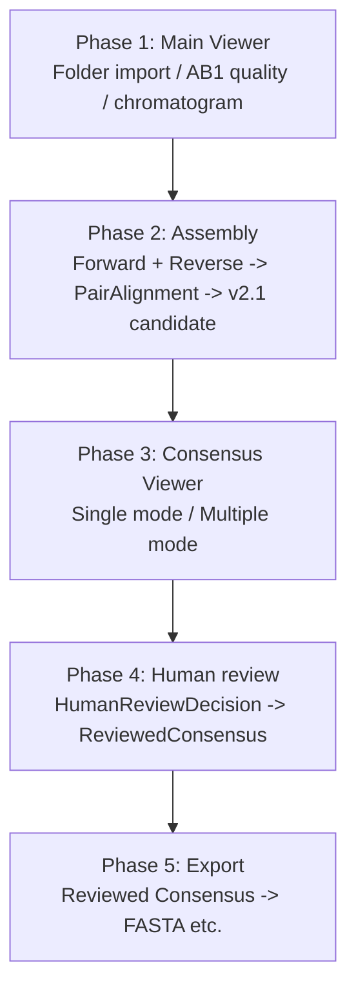
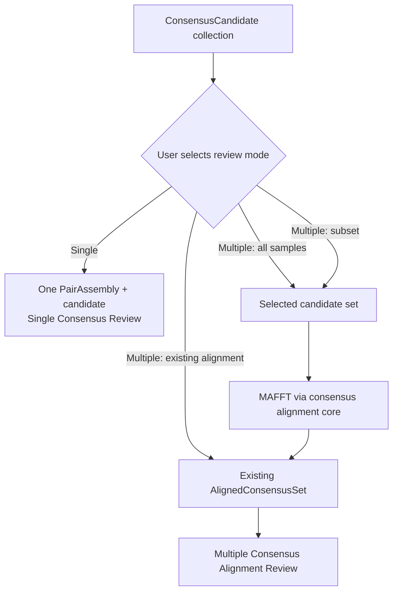
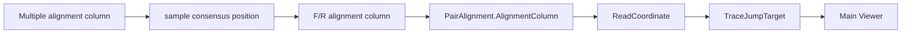
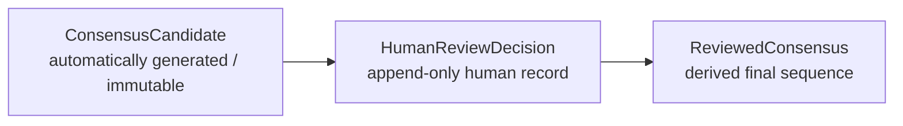
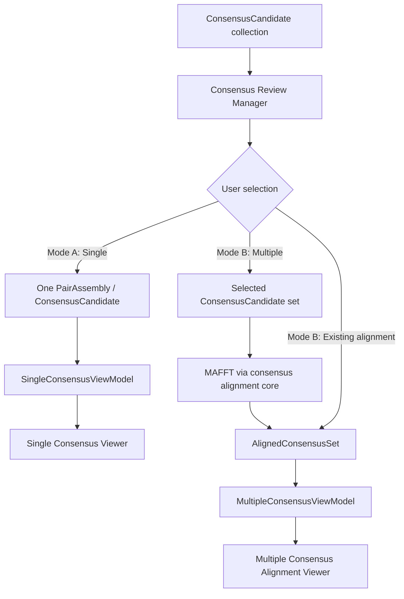
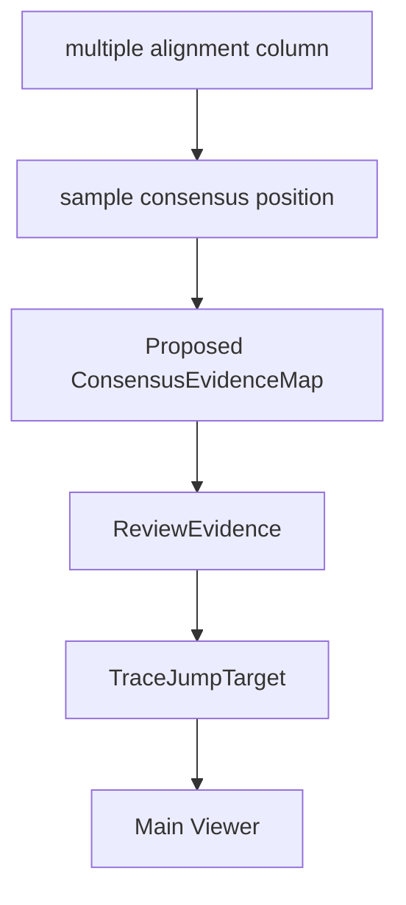

# Consensus Viewer 統合設計

## この文書の目的

この文書は、現在存在するSingle Consensus ReviewとMultiple Consensus Alignment Viewerを、将来的に一つの`Consensus Viewer`として整理するための設計提案である。現在のコードを唯一の実装事実とする。実装済みの画面・core契約と、将来の統合・人手編集・exportを明確に区別する。

関連する個別設計は[CONSENSUS_VIEWER_DESIGN.md](CONSENSUS_VIEWER_DESIGN.md)、[SINGLE_CONSENSUS_REVIEW_GUI_DESIGN.md](SINGLE_CONSENSUS_REVIEW_GUI_DESIGN.md)、[MULTIPLE_CONSENSUS_ALIGNMENT_VIEWER_DESIGN.md](MULTIPLE_CONSENSUS_ALIGNMENT_VIEWER_DESIGN.md)、[MULTIPLE_CONSENSUS_ALIGNMENT_WORKFLOW_DESIGN.md](MULTIPLE_CONSENSUS_ALIGNMENT_WORKFLOW_DESIGN.md)を参照する。pair consensusの責務は[CONSENSUS_V2_1_DESIGN.md](CONSENSUS_V2_1_DESIGN.md)を参照する。

## 1. Positioning

SangerFlowにおける`Consensus Viewer`は、次のreview workflowの中心となる**将来の統合interface**である。

```text
AB1 -> F/R Assembly -> Consensus generation -> Human review -> Export
```

| interface | 主な責務 | 行わないこと |
|---|---|---|
| Main Viewer | raw AB1 quality、chromatogram、trace positionの確認 | consensusの科学的決定、sample間alignmentの解釈 |
| Consensus Viewer | assembled consensus確認、sample間比較、人手review、将来のmanual edit | AB1読込、base calling、F/R alignment計算、MAFFT実行 |

### 現在の実装

- `gui/consensus_viewer.py` の`SingleConsensusReviewWindow`は、1 pair sampleの`ConsensusV21Result`と`ReviewEvidence`を表示するprototypeである。
- `gui/multiple_consensus_viewer.py` の`MultipleConsensusAlignmentWindow`は、`AlignedConsensusSet`をMEGA/Mesquite型matrixで表示するprototypeである。gap、variable site、column selectionを表示する。
- `core/consensus_alignment.py` の`run_consensus_alignment()`は、consensus sequenceをMAFFTで整列し、`AlignedConsensusSet`を返す。
- `gui/main_window.py`には`open_single_consensus_review()`とtrace jump callbackがある。

### 未実装の提案

- Single / Multiple modeを一つのwindowまたは共通controllerに統合すること。
- Multiple modeから対応するSingle modeを開くcallbackの実接続。
- `HumanReviewDecision`、`ReviewedConsensus`、manual edit履歴、review済み配列のexport。

## 2. Workflow

次の5 phaseは**将来の正式workflowの提案**である。現在は各機能がprototypeや独立launcherとして存在し、正式な一連のpipelineには統合されていない。



| Phase | 入力 | 出力 | 実装状況 |
|---|---|---|---|
| 1. Main Viewer | AB1 folder / `SangerRead` | quality・trace確認 | 一部実装済み |
| 2. Assembly | trim済みForward/Reverse | `PairAlignment`、v2.1 candidate | core実装済み。v2.1はshadow candidate |
| 3. Consensus Viewer | 1 pair result、またはユーザーが選択した`ConsensusCandidate`集合 / `AlignedConsensusSet` | 人間が確認できる表示 | Single / Multiple prototypeは実装済み。統合は未実装 |
| 4. Human review | candidateと根拠 | `HumanReviewDecision`、`ReviewedConsensus` | 未実装の提案 |
| 5. Export | review済み配列 | FASTA等 | 未実装の提案 |

`poor read`の除外基準やfinal dataset inclusionは、GUIが暗黙に決めてはならない。Review Engineと人間の判断を分けて設計する。

## 3. Consensus Viewer modes

### Mode A: Single Consensus Review

**入力（実装済み）**

- `PairAlignment`
- `ConsensusV21Result`（v2.1 shadow）
- `ReviewEvidence`

**表示（実装済みprototype）**

- consensus sequence、base status、decision reason、confidence、selected source。
- Forward / Reverseのbase、quality、raw / trimmed index、raw / trimmed trace position。
- `TraceJumpTarget`に基づくForward / Reverse chromatogram callback。

**用途**: 1 sampleのF/R contig候補を、元AB1の根拠へ追跡して確認する。

Single modeはindividual sequence validationを目的とする。入力は1つの`PairAlignment`と対応するcandidateであり、multiple sequence alignmentは実行しない。

### Mode B: Multiple Consensus Alignment Review

**入力（実装済みの表示契約）**

- `AlignedConsensusSet`

**将来のselection workflow（提案）**

Multiple modeを開く前に、ユーザーがalignment対象を明示的に選択する。automatic alignmentは必須ではなく、Consensus Candidateが生成された時点で全sampleを自動整列してはならない。

| 選択肢 | 入力 | 実行内容 |
|---|---|---|
| 全sample | 現在のcandidate collection全体 | ユーザー確認後にMAFFTを実行し、`AlignedConsensusSet`を作る。 |
| subset sample | ユーザーが選択したcandidate集合 | 選択集合だけをMAFFTへ渡す。選択外sampleを暗黙に追加しない。 |
| existing alignment | 既存の`AlignedConsensusSet` | MAFFTを再実行せず、そのalignmentをMultiple Viewerで開く。 |



MAFFTの実行は`core/consensus_alignment.py`の責務とし、Multiple Viewerやmode selectorはalignmentを直接生成しない。selection内容、alignment engine、parameter、作成日時は、将来project saveが実装される場合に再現できるよう記録する**提案**である。

**表示（実装済みprototype）**

- sample rowとMAFFT後のaligned consensus matrix。
- gap、IUPAC、variable column、position ruler。
- Variable Site Panelと、panelからのmatrix column selection。
- sample ID、multiple alignment column、sample consensus position、baseの表示。

**用途**: ユーザーが選んだsample集合の差異、gap、`N`、IUPAC、variable siteを比較し、人間が生物学的解釈の前に配列を確認する。

Mode BのalignmentはAB1 read alignmentではない。F/R contig assemblyとmultiple consensus alignmentを同じ処理として扱ってはならない。

## 4. Navigation design

### 座標の分離

| 座標 | 意味 | 代表model |
|---|---|---|
| multiple alignment column | 複数sample間alignmentの0-based column | `AlignedConsensusSequence.consensus_position_mapping` |
| sample consensus position | gapを除く1 sample内の0-based候補位置 | `MultipleAlignmentRow` |
| F/R alignment column | 1 pair sample内の0-based assembly column | `PairAlignment` / `AlignmentColumn` |
| raw trace position | AB1 chromatogramのpeak位置 | `ReadCoordinate` / `TraceJumpTarget` |



Multiple modeからSingle modeへのB -> Cの対応は、pair candidateのconsensus positionとdecisionの`alignment_index`が同じ場合に限って単純に扱える。将来manual editやsingle-read final sequenceを含める場合は、`SequenceProvenance`または同等の明示的mappingが必要である。未確認またはgapの位置は推測せず、navigationを無効にする。

Single modeとMain Viewerのtrace navigationでは、`TraceJumpTarget(read_identifier, raw_trace_position)`を唯一の経路とする。GUIはraw index、trimmed index、reverse-complement indexからtrace位置を再計算しない。

## 5. Human Review and Reviewed Consensus

### Motivation

Consensus v2.1は自動生成されたcandidate sequenceである。しかしSanger sequencing workflowでは、chromatogram確認に基づくbase修正、ambiguous baseへの変更、low-confidence positionの確認、sequencing errorの除外といった人間の判断が必要になる。

これらの判断を`ConsensusCandidate`へ直接書き込んではならない。元の自動生成結果を保持し、変更理由を追跡し、後から再reviewできるようにするためである。以下はすべて**未実装の提案**である。

### Data hierarchy



| model | 責務 | 変更方針 |
|---|---|---|
| `ConsensusCandidate` | 自動生成されたcandidate sequenceとdecision evidenceの参照元。 | 上書き禁止。 |
| `HumanReviewDecision` | 1 positionへの人間の判断と根拠。 | append-only recordを提案。 |
| `ReviewedConsensus` | candidateにdecisionを適用した派生sequence。 | candidateとdecisionから再構築可能にする。 |

### `HumanReviewDecision`

提案する保持情報は次のとおりである。

- `sample_id`
- `consensus_position`
- `original_base`
- `reviewed_base`
- `decision_type`
- `reason`
- `evidence_reference`
- `reviewer`
- `timestamp`

multiple alignment上で判断した場合は、表示上のmultiple alignment columnも記録してよい。ただしcandidateに適用する位置はsample固有の`consensus_position`とし、MAFFT gap positionを編集位置として使わない。

```text
sample: IK345
position: 546
original: A
reviewed: G
reason: Forward and Reverse chromatograms support G
evidence: Forward Q38; Reverse Q35
```

`evidence_reference`は既存`ReviewEvidence`、`ConsensusEvidenceMap`、または将来の`SequenceProvenance`を指す。`TraceJumpTarget`そのものを保存する場合も、既存座標をコピー・再計算せず、read identifierとraw trace positionの組を根拠参照として扱う。

### Decision types

| decision type | 意味 | `ReviewedConsensus`への効果 |
|---|---|---|
| `ACCEPT` | `ConsensusCandidate`のbaseをそのまま採用する。 | baseは変えない。 |
| `CHANGE` | 根拠を記録してbaseを変更する。 | `reviewed_base`へ置換する。 |
| `AMBIGUOUS` | IUPAC ambiguity codeへ変更する。 | 記録したIUPAC codeへ置換する。 |
| `REJECT` | low-quality領域として除外候補にする。 | 配列除外・追加trim・`N`化のどれにするかは別の明示的policyで決める。 |

`REJECT`は自動的にsequenceを削除・trim・変更しない。dataset inclusionや最終配列への適用は、別途保存されたpolicyと人間確認を必要とする。

### Review workflow

```text
Multiple Viewer
    -> Variable Site selection
    -> Evidence Panel
    -> Chromatogram confirmation
    -> HumanReviewDecision creation
    -> ReviewedConsensus update
```

Single Consensus Reviewでも同じ`HumanReviewDecision`を作れるようにする。Single / Multipleの違いは判断に到達する表示経路であり、decision recordの意味を変えてはならない。

### GUI concept

次は未実装のEvidence Panel操作案である。

```text
Current base: A

Forward: A Q40
Reverse: G Q35

[Accept] [Change Base]

Change dialog
Current: A
New:     G
Reason:  ____________________
[Save Decision]
```

GUIは`ConsensusCandidate`を直接編集しない。`Save Decision`は新しい`HumanReviewDecision`を追加する操作とし、`ReviewedConsensus`はそれらから派生表示する。

### `ReviewedConsensus`

`ReviewedConsensus`は少なくとも次を保持する提案とする。

- original candidate reference。
- final sequence。
- applied decisions。

```text
ConsensusCandidate: ATGCA
HumanReviewDecision: position 4: C -> T
ReviewedConsensus: ATGTA
```

### Multiple alignment interaction

Multiple Viewer上で`ConsensusCandidate`を直接編集してはならない。表示対象は`Candidate alignment`または`ReviewedConsensus alignment`として明示する。

`ReviewedConsensus`へ変更を適用した後、既存multiple alignmentをそのまま保持できるとは限らない。gapや長さが変わる編集では、alignmentを再実行するか、candidate alignmentとの差分として表示するかを明示的に選ぶ必要がある。暗黙のMAFFT再実行は行わない。

### Evidence linkage

manual editは必ずevidenceと関連付ける。例として`A -> G`の変更は、Forward / Reverse chromatogram、対応する`ReviewEvidence`、必要に応じて`TraceJumpTarget`を参照できる形で保存する。

この参照は科学的な正しさを自動保証するものではないが、誰が、どの候補baseを、どの根拠で変更したかを監査可能にする。

### Export connection

review済みworkflowのexport対象は`ReviewedConsensus`を推奨する。`ConsensusCandidate`の直接exportを禁止するものではないが、candidate exportであることをファイル名、metadata、UIで明確に区別する。

### Non-goals

Human Reviewは、automatic base correction、AIによる判断、chromatogram peak再解析、consensus algorithm変更を行わない。既存のConsensus Review Manager、Single / Multiple Viewer、`ReviewEvidence`、`ConsensusEvidenceMap`、`TraceJumpTarget`の責務分離を維持する。

## 6. UI concept

次は統合windowの**提案**である。現在の二つの`Toplevel` prototypeを否定・置換するものではなく、段階的に共通controllerへまとめるための目標とする。

```text
Consensus Viewer
┌───────────────────────────────────────────────────────────────┐
│ [Single Consensus Review] [Multiple Consensus Alignment]      │
├───────────────────────────────────────────────────────────────┤
│ Single: sequence panel + evidence + trace navigation           │
│ Multiple: alignment matrix + Variable Site Panel                │
├───────────────────────────────────────────────────────────────┤
│ Common: sample selection / review status / future export       │
└───────────────────────────────────────────────────────────────┘
```

| 共通UI要素 | 初期方針 |
|---|---|
| mode selector | `Single`、`Multiple: all samples`、`Multiple: subset`、`Multiple: existing alignment`を選ぶ。選択だけではalignmentやconsensusを再計算しない。 |
| navigation | 対応可能なroot evidenceがある場合だけSingle modeまたはMain Viewerへのrequestを出す。 |
| review status | 将来の`HumanReviewDecision`を表示する。現段階でGUIがPASS / REVIEW / FAILを変更しない。 |
| export | `ReviewedConsensus`が実装されるまで無効または未提供とする。 |

## 7. Consensus Review Manager

### Positioning

`Consensus Review Manager`は、`ConsensusCandidate`集合と各Review Viewerの間に置く**将来のworkflow管理interface**である。Viewerが対象選択、workflow判断、MAFFT実行を担うことを避けるための中間層として位置付ける。

| 責務 | 内容 |
|---|---|
| Candidate一覧管理 | 利用可能な`ConsensusCandidate`をsample単位で一覧化する。 |
| review対象selection | all candidates、subset candidates、existing alignmentを明示的に選択する。 |
| review mode selection | Single / Multiple review workflowを選ぶ。 |
| alignment workflow selection | selected candidateにMAFFTを実行するか、existing alignmentを開くかを選ぶ。 |
| object routing | 選択結果をSingle ViewerまたはMultiple Viewerへ入力として渡す。 |

Viewer自身はworkflow判断やMAFFT実行を行わない。Managerもconsensus algorithm、base calling、human editを実行しない。

### Workflow



Mode Aの入力は1つの`PairAssembly` / `ConsensusCandidate`であり、Single Consensus Viewerを開く。Mode Bの入力はユーザーが選んだcandidate集合であり、MAFFT後の`AlignedConsensusSet`をMultiple Viewerへ渡す。existing alignmentを選んだ場合はMAFFTを再実行しない。

### Candidate Selection

| 選択肢 | 内容 | alignmentの扱い |
|---|---|---|
| All candidates | 全sampleをalignment対象とする。 | ユーザーが`Run MAFFT`を選んだ場合だけ実行する。 |
| Subset candidates | 一部sampleだけを選択する。例: 同一種、同一地域、特定population。 | 選択集合だけをMAFFTへ渡す。選択外sampleを追加しない。 |
| Existing alignment | 既存の`AlignedConsensusSet`を選ぶ。 | MAFFTを再実行せず、alignment columnを保持してViewerへ直接渡す。 |

### Responsibility separation

| コンポーネント | 責務 |
|---|---|
| Consensus Review Manager | workflow管理、user selection、object routing。 |
| Consensus Viewer | visualization、review interaction。 |
| MAFFT / consensus alignment core | consensus sequenceのmultiple alignment生成。 |
| Main Viewer | AB1 chromatogram visualization。 |

Managerは`core/consensus_alignment.py`を呼び出すcontrollerになり得るが、MAFFTのsubprocess制御、alignment resultの座標計算、Viewer描画ロジックを自身に複製しない。これらはそれぞれ既存coreとGUI adapterの責務に残す。

### Data flow

```text
ConsensusCandidate
        |
        v
Consensus Review Manager
        |
        +-------------------------------+
        |                               |
        v                               v
SingleConsensusViewModel         AlignedConsensusSet
                                        |
                                        v
                         MultipleConsensusViewModel
```

### Future UI concept

次は未実装のUI案である。

```text
Consensus Review Manager
┌─────────────────────────────────────────────────────────────┐
│ Candidate table                                               │
│ Sample | Length | Status | Selected                           │
├─────────────────────────────────────────────────────────────┤
│ Review mode:  ( ) Single review  ( ) Multiple alignment      │
│ Alignment:    ( ) Run MAFFT      ( ) Open existing alignment │
│                                             [Open Review]    │
└─────────────────────────────────────────────────────────────┘
```

`Status`は候補の状態を表示するための領域であり、ManagerがPASS / REVIEW / FAILを決定・変更するものではない。

### Non-goals

Consensus Review Managerでは、次を行わない。

- consensus algorithm変更。
- base calling、automatic correction、manual edit。
- `HumanReviewDecision`の内容決定。

human editingは、別の次のworkflowで扱う提案である。

```text
ConsensusCandidate
    -> HumanReviewDecision
    -> ReviewedConsensus
```

## 8. Consensus Evidence Integration

### Motivation

Multiple Consensus Alignment Viewerは現在、aligned sequence、sample ID、multiple alignment column、sample consensus positionを表示する。しかしSanger配列のreviewでは、塩基そのものだけでなく「なぜその塩基になったのか」を確認する必要がある。

したがって、Multiple Alignment Reviewから次のevidence経路を提供する**提案**とする。

```text
Multiple Alignment Review
    -> sample consensus position
    -> ReviewEvidence
    -> chromatogram
```

現行の`gui/multiple_consensus_viewer.py`は、sample base、alignment column、consensus positionを表示できる。一方、Forward / Reverse evidence panel、`ReviewEvidence` lookup、chromatogram jumpは未実装である。

### Responsibility separation

| 層 | 担当 | 担当しないこと |
|---|---|---|
| Multiple Consensus Alignment Viewer | alignment matrix、variable site、column / sample selectionの表示 | AB1読込、chromatogram描画、consensus再計算、evidence生成 |
| Evidence Layer | Forward / Reverse evidence、quality、raw trace position、`TraceJumpTarget`を提供 | multiple alignment計算、Viewer描画、base採用の再判断 |
| Main Viewer | raw chromatogram表示、trace navigation | multiple alignmentの解釈、evidence座標の再計算 |

### Data flow

Multiple Viewerでsample baseを選択した場合、次の経路だけを使う。



`ReviewEvidence`は現在、Single Consensus Reviewで`PairAlignment -> AlignmentColumn -> ReadCoordinate`から生成される。Multiple modeはこの既存evidenceを再計算せず、sample IDとconsensus positionで参照するだけにする。

### `ConsensusEvidenceMap`

次は未実装のadapter model提案である。

```text
ConsensusEvidenceMap
    - sample_id
    - consensus_position
    - ReviewEvidence
```

目的は、`AlignedConsensusSet`のsample consensus positionと既存`ReviewEvidence`を結ぶことである。`AlignedConsensusSet`自体へAB1、quality、trace、`ReviewEvidence`を追加してはならない。multiple alignment dataとraw evidenceの責務・保存量・更新周期を分離するためである。

`ConsensusEvidenceMap`は、candidate生成時のsample IDとconsensus positionが同じcandidateを指すことを検証する必要がある。manual editやsingle-read final sequenceを導入した後は、単純なposition一致を仮定せず、`SequenceProvenance`または同等の明示的mappingを使う。

### GUI concept

次は未実装のMultiple Viewer evidence panel案である。

```text
Alignment Matrix
IK345  ATGC...
IK346  ATGT...
IK347  ATGC...

Selected cell
Sample: IK347
Multiple alignment column: 546
Consensus position: 546

Evidence Panel
Consensus: T
Forward: base T, quality 38
Reverse: base T, quality 34
[Forward chromatogram] [Reverse chromatogram]
```

Evidence panelは`ConsensusEvidenceMap`から得た`ReviewEvidence`を表示するだけである。base、quality、raw index、trimmed index、raw / trimmed trace positionは、Multiple Viewerが独自計算しない。

### Gap handling

次の状態ではevidence lookupとtrace navigationを禁止する。

```text
Alignment column: 100
Sample: IK347
Base: -
Consensus position: None
```

gapはraw trace coordinateを持たない。前後alignment column、近接base、gap lengthからconsensus positionやtrace位置を推定してはならない。UIには`Gap position has no chromatogram evidence.`と表示し、chromatogram buttonを無効にする。

### Single / Multiple integration

| mode | 主な入力 | evidence解決 |
|---|---|---|
| Single Consensus Review | `PairAlignment` + `ReviewEvidence` | decisionの`alignment_index`から既存bridgeを使う |
| Multiple Consensus Review | `AlignedConsensusSet` + proposed `ConsensusEvidenceMap` | sample consensus positionで既存`ReviewEvidence`を参照する |

両modeは最終的に同じ`ReviewEvidence -> TraceJumpTarget -> Main Viewer`経路を共有する。Multiple modeが独自のchromatogram座標系を持ってはならない。

### Navigation rule

chromatogram navigationには`TraceJumpTarget`だけを使用する。次を禁止する。

- multiple alignment columnからraw trace positionを直接推定すること。
- gap位置からtrace jumpすること。
- Viewer内でreverse-complement index、raw index、trace positionを独自に計算すること。

### Future extension

人間によるevidence確認は、将来次の経路で記録する提案である。

```text
Evidence confirmation
    -> HumanReviewDecision
    -> ReviewedConsensus
```

automatic base correction、AI peak calling、consensus algorithm変更は本章の対象外である。

## 9. Non-goals

この統合設計では、次を実装・変更しない。

- automatic correction、AIによるbase calling、new consensus algorithm。
- candidate collectionに対する暗黙のautomatic multiple alignment。
- `core/consensus.py`、`core/consensus_v2_1.py`、Review Engineの判定基準。
- MAFFTの実行方式・parameter・`AlignedConsensusSet`契約。
- raw AB1 / traceデータの複製、chromatogram編集。
- automatic variant calling、phylogenetic analysis。

## 10. Future implementation order

| Step | 内容 | 前提条件 | 完了条件 |
|---|---|---|---|
| 1 | 本統合設計のreviewと固定 | 現行prototypeの責務確認 | 実装済み／提案の境界に合意する |
| 2 | Multiple -> Single callback | sample consensus positionからSingle view modelへ戻る明示的map | gapでは無効、non-gapの既知sampleで正しいSingle selectionを開く |
| 3 | Single -> Main Viewer trace navigationの統合確認 | `TraceJumpTarget` callback | raw trace positionを再計算せず既存Coordinate Inspectorへ渡す |
| 4 | `HumanReviewDecision` | immutable candidateとprovenance方針 | decision理由とevidence referenceを保存できる |
| 5 | `ReviewedConsensus` export | review decisionの再現可能な適用 | candidateを上書きせずreview済み配列だけを明示的にexportする |

大規模なGUI再設計は確定事項ではなく検討候補である。各stepは小さな差分として、座標経路、gap、raw / trimmed index、trace positionをテストまたは手動確認してから進める。

## 11. 既存文書との整合性

- [CONSENSUS_VIEWER_DESIGN.md](CONSENSUS_VIEWER_DESIGN.md)と[SINGLE_CONSENSUS_REVIEW_GUI_DESIGN.md](SINGLE_CONSENSUS_REVIEW_GUI_DESIGN.md)には、Single GUIを「未実装の提案」とする古い記述がある。しかし現行の`gui/consensus_viewer.py`にはprototypeが存在するため、本書ではコードを正として「実装済みprototype」と記録する。
- [MULTIPLE_CONSENSUS_ALIGNMENT_VIEWER_DESIGN.md](MULTIPLE_CONSENSUS_ALIGNMENT_VIEWER_DESIGN.md)のMultiple Viewer構想は、現行`gui/multiple_consensus_viewer.py`のread-only prototypeと整合する。ただしhuman editingと正式workflow統合は未実装である。
- [MULTIPLE_CONSENSUS_ALIGNMENT_WORKFLOW_DESIGN.md](MULTIPLE_CONSENSUS_ALIGNMENT_WORKFLOW_DESIGN.md)の`AlignedConsensusSet`・gap mappingの責務は、現行`core/consensus_alignment.py`と整合する。本書はそのcontractを変更しない。
