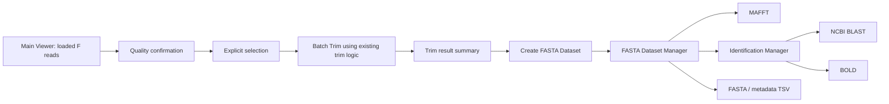
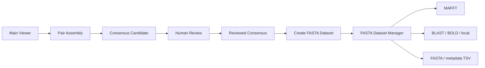
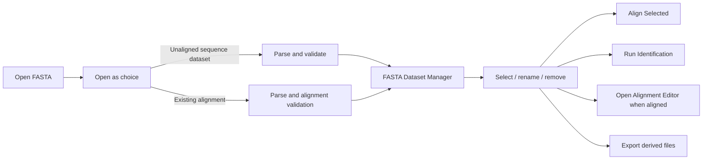
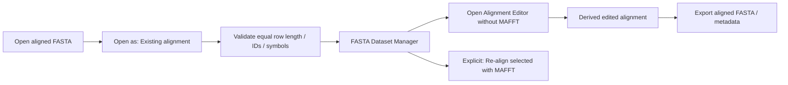

# FASTAとSequence Datasetの設計

## 0. 文書の位置づけ

### 0.1 目的

現在のSangerFlowは `SangerRead` とAB1読込を主な入口とし、FASTAは主にMAFFT入力またはexport形式として扱っている。本設計は、FASTAをAB1と並ぶ正式なinput datasetとして扱い、AB1由来、consensus由来、reviewed consensus由来、外部FASTA由来の配列を、同じ明示的な境界からMAFFT、Alignment Editor、Identification、exportへ渡せるようにする。

対象とするFASTAは次のとおりである。

- Forward readを一括trimして生成したFASTA
- 外部から受領したFASTA
- GenBankまたはBOLD由来のFASTA
- 既存の整列済みFASTA
- SangerFlowで生成したConsensus FASTA
- Reviewed Consensus FASTA

### 0.2 今回の範囲

本書は設計文書であり、Python、GUI、test、外部API、永続化形式を実装しない。クラス名、module名、method名は提案であり、現在実装済みのAPIと区別するため「提案」と明記する。

### 0.3 設計原則

1. **FASTAを正式なinputにする**: FASTAを一時fileやexport副産物としてだけ扱わず、検証済みdatasetとしてGUIと解析へ渡す。
2. **解析は自動開始しない**: FASTAを開いただけでMAFFT、NCBI BLAST、BOLD、local BLASTを実行しない。
3. **配列表現を明示する**: raw、trimmed、consensus candidate、reviewed consensus、aligned sequenceを暗黙に切り替えない。
4. **既存モデルを正とする**: `SangerRead`、`Sample`、`ConsensusV21Result`、`ReviewedConsensus`、`AlignedConsensusSet` を重複定義しない。dataset側は参照またはadapterを持つ。
5. **元データを不変として扱う**: rename、selection、alignment、edit、exportは元AB1、元FASTA、元consensusを上書きせず、派生状態または派生物として作る。
6. **provenanceを失わない**: sequence ID、由来、使用representation、元object/file、trim座標、review状態、alignment状態を追跡できるようにする。
7. **科学的判断をUI heuristicで確定しない**: aligned候補、invalid symbol、N/IUPAC、gap、duplicate IDは表示・検証するが、解析可否や生物学的妥当性を一律に自動決定しない。
8. **解析GUIはfileを読み直さない**: 各解析は `SequenceDataset` または明示的な派生datasetをinputとして受け取る。

## 1. 現在のコードと設計上の差分

### 1.1 再利用できる既存API・モデル

| 現在の要素 | 現在の役割 | 本設計での再利用方針 |
|---|---|---|
| `core.models.SangerRead` | raw sequence、quality、trace、peak、trim済み派生状態を保持 | raw/trimmed recordのsource objectとして参照する。datasetへtraceやqualityを複製しない |
| `core.sequence_loader.load_ab1_file()` / `load_ab1_folder()` | AB1読込、trim、品質統計 | Main Viewerで既に読み込まれたobjectを優先し、dataset化のために再読込しない |
| `core.trimming.trim_sequence()` | `SangerRead` にtrim済み配列、品質、座標、traceを設定 | Batch Trimの既存科学ロジックとして再利用候補。dataset層でtrimアルゴリズムを再実装しない |
| `core.samples.Sample` / `classify_reads_by_filename()` | readをF/R/single/ambiguousへ分類 | F-onlyとF/R workflowのsource groupingに再利用する |
| `core.assembly_models.PairAlignment` | F/R pair alignmentとread座標provenance | consensus candidateのsource referenceとして保持可能。datasetにalignment列を複製しない |
| `core.consensus_v2_1.ConsensusV21Result` | `consensus_sequence`、decision、metrics | candidate recordのsource objectとして参照する |
| `core.human_review.ReviewedConsensus` | original/reviewed sequenceと適用decision | reviewed recordのsource objectとして参照する |
| `core.reviewed_consensus.build_reviewed_consensus()` | review sessionからreviewed sequenceを派生 | reviewed dataset作成前の既存境界として再利用する |
| `core.consensus_alignment.ConsensusAlignmentInput` | MAFFTへ渡すsample ID、sequence、metadata | `SequenceDataset` → current consensus alignmentのadapter先として再利用する |
| `core.consensus_alignment.AlignedConsensusSet` | consensus alignmentとgap-aware座標map | consensus由来alignmentのsource referenceとして再利用する |
| `core.consensus_alignment.run_consensus_alignment()` | in-memory FASTAでMAFFTを実行 | Phase 4の最初のdataset alignment adapterから再利用する候補 |
| `core.chromatogram_alignment.align_reads()` | trimmed AB1 readをMAFFTへ送る | legacy read-level経路。移行中は維持するが、新GUIからはdataset routerを優先する |
| `core.chromatogram_alignment.align_fasta()` | FASTA fileを読み、常にMAFFTを実行 | 現状把握に利用。将来はparserとanalysisを分離し、直接GUI入口にはしない |
| `core.blast.blast_sequence()` | 文字列1本をNCBI Web BLASTへ送る | identification adapterの低レベル呼出しとして再利用候補。dataset、rate、error責務は別controllerに置く |
| `core.exporter.save_fasta()` / `export_consensus_fasta()` | 単一readまたは単一consensusのFASTA出力 | 既存用途は維持。dataset複数record exportには新しい共通exporterが必要 |
| `core.reviewed_export.export_reviewed_consensus_fasta()` | 単一reviewed consensus出力 | reviewed recordの既存exportとして再利用可能 |
| `gui.multiple_consensus_viewer.current_alignment_records()` 等 | 現在表示/編集状態からrecord列を得る | current/edited aligned datasetを生成するGUI adapterとして再利用候補 |
| `tools.launch_multiple_consensus_viewer.load_aligned_consensus_fasta()` | alignment済みFASTAをMAFFTなしでprototype viewerへ読む | Existing Alignment workflowの先行例。validationと一般dataset化は新規に必要 |

### 1.2 新規に必要な責務

| 新規責務 | 理由 |
|---|---|
| 一般 `SequenceDataset` / `SequenceRecord` core model | AB1、consensus、FASTAを解析へ渡す共通境界がない |
| FASTA parserとvalidation report | 現在は各GUI/toolが独自に `SeqIO.parse()` またはfile全文読込を行う |
| source adapter群 | 既存objectを重複せず共通recordへ写像する必要がある |
| alignment状態の明示モデル | `source_type` だけではunalignedとalignedを安全に区別できない |
| dataset selection/rename派生操作 | GUI状態をsource objectへ書き戻さないため |
| FASTA Dataset Manager | validation、selection、rename、routingの共通画面がない |
| Main Viewer dataset provider | 現在読み込まれたread/candidate/reviewed resultを再選択なしで利用する境界がない |
| analysis router / capability validation | gap付きalignmentをBLASTへ送る等の誤routingを防ぐ必要がある |
| dataset FASTA / metadata TSV exporter | 複数record、provenance、alignment状態を統一して出力するAPIがない |
| Identification Manager | NCBI/BOLD/local targetとinput representationを明示する共通画面がない |

## 2. Workflow

### 2.1 A. F-only workflow



処理境界は次のとおりとする。

1. Main Viewerが保持する現在の `SangerRead` 集合を再読込しない。
2. `Sample` classificationからForward readまたは利用者が明示的に選択したsingle readを得る。
3. Batch Trimは既存 `trim_sequence()` と同じ科学的ロジックを使い、各readのraw sequence、quality、peak position、trim座標との対応を維持する。
4. trim失敗、空配列、短い配列は自動削除せず、statusとしてManagerへ渡す。
5. 利用者が `AB1_TRIMMED` representationを確認してdatasetを作る。
6. MAFFT、Identification、exportはManagerまたはBatch Trim完了画面から明示操作で開始する。

`SequenceDataset` は `SangerRead` を所有・変更せず、recordごとにsource referenceと `trim_start` / `trim_end` のsnapshot metadataを持つ。元readのtrim状態が後で変わり得る場合、作成時sequenceをimmutable snapshotとして固定し、source referenceとの整合性をprovenanceとして記録する。どちらを採るかはPhase 1でAPI契約として固定する。

### 2.2 B. F/R workflow



設計上、candidateとreviewed consensusを別representationとして扱う。

- Candidate recordは `ConsensusV21Result` と可能なら `PairAlignment` / review evidenceへの参照を持つ。
- Reviewed recordは `ReviewedConsensus` と `ConsensusReviewSession` への参照または識別子を持つ。
- `original_sequence` と `reviewed_sequence` を上書きで統合しない。
- dataset作成画面で `Consensus candidates` と `Reviewed consensus` を混在させる場合は、各rowのsource/statusを明示する。
- REVIEW/FAIL相当のcandidateを解析へ含めるかは利用者が明示的に選ぶ。dataset layerが自動で科学的合否を決めない。

### 2.3 C. Imported FASTA workflow



FASTAを開いた時点ではparser、validation、previewだけを実行する。MAFFT、BLAST、BOLDは実行しない。

### 2.4 D. Existing alignment workflow



既存alignmentとして開く場合、同じ長さであることは構造検証するが、それだけで正しい生物学的alignmentとは判定しない。MAFFT再実行はdefaultでOFFとし、利用者が `Re-align selected` を明示した場合にだけ新しい派生alignmentを作る。

## 3. `SequenceDataset` core design

### 3.1 モデルの役割

`SequenceDataset` は解析対象の明示的なsnapshotと順序を表す。project persistence、GUI widget state、解析結果そのものは保持しない。

提案module:

```text
core/sequence_dataset.py          # value objects and invariants
core/sequence_adapters.py         # existing model → dataset
core/fasta_import.py              # parse and validation report
core/sequence_routing.py          # capability checks and derived inputs
core/sequence_dataset_export.py   # FASTA and metadata TSV
```

module分割は提案であり、Phase 1の小規模実装では `sequence_dataset.py` と `fasta_import.py` から開始してよい。

### 3.2 提案する型

```python
class SequenceSourceType(str, Enum):
    AB1_RAW = "AB1_RAW"
    AB1_TRIMMED = "AB1_TRIMMED"
    CONSENSUS_CANDIDATE = "CONSENSUS_CANDIDATE"
    REVIEWED_CONSENSUS = "REVIEWED_CONSENSUS"
    IMPORTED_FASTA = "IMPORTED_FASTA"
    IMPORTED_ALIGNMENT = "IMPORTED_ALIGNMENT"


class DatasetStructure(str, Enum):
    UNALIGNED = "UNALIGNED"
    EXISTING_ALIGNMENT = "EXISTING_ALIGNMENT"
    DERIVED_ALIGNMENT = "DERIVED_ALIGNMENT"


@dataclass(frozen=True)
class SequenceRecord:
    sequence_id: str
    sequence: str
    description: str
    source_type: SequenceSourceType
    source_reference: object | None
    metadata: Mapping[str, object]


@dataclass(frozen=True)
class SequenceDataset:
    dataset_id: str
    name: str
    source_type: SequenceSourceType | None
    structure: DatasetStructure
    sequences: tuple[SequenceRecord, ...]
    created_at: datetime
    metadata: Mapping[str, object]
```

`SequenceDataset.source_type` はdataset全体が同一由来なら値を持ち、複数由来を統合したdatasetでは `None` とする。各recordの `source_type` は必須とする。これにより、dataset全体の利便性のためにprovenanceを失わない。

### 3.3 `source_type` と `structure` を分ける理由

`IMPORTED_FASTA` は由来を表すが、unalignedかalignedかを安全に表せない。また、`REVIEWED_CONSENSUS` をMAFFTへ渡した結果は由来がreviewed consensusのまま、構造はderived alignmentになる。このため次の2軸を混同しない。

| 軸 | 例 | 意味 |
|---|---|---|
| source/provenance | `AB1_TRIMMED`, `REVIEWED_CONSENSUS`, `IMPORTED_FASTA` | 配列がどこから来たか |
| structure | `UNALIGNED`, `EXISTING_ALIGNMENT`, `DERIVED_ALIGNMENT` | gapを含む共通alignment columnを持つか |

### 3.4 record invariant

Phase 1では次のinvariantをcoreで検証する。

- `sequence_id` は空でない。
- 同一dataset内のeffective IDは一意である。
- `sequence` は空でない。空recordはimport reportには残すが、valid `SequenceRecord` にはしない。
- sequenceは正規化後に大文字とする。元表記はmetadataに保持可能とする。
- unaligned recordは `-` を原則禁止する。ただしimport validationの段階ではerror/warningとして保持し、利用者がExisting alignmentとして開き直せる。
- aligned recordは `-` を許可する。
- DNA/IUPAC候補は `A C G T N R Y S W K M B D H V` とする。`U`、`?`、`.`、`*`、whitespace等の扱いはvalidator policyとして明示し、silent変換しない。
- `source_reference` はopaque/read-only参照とし、dataset modelが具象classをimportして強く結合しない。
- `metadata` は補助情報であり、sequence、ID、source type、structureのauthorityにしない。
- record順序はinput順を保持する。sortは明示的な派生操作とする。

### 3.5 source adapter

adapterは既存モデルから明示的representationを選び、immutable record snapshotを作る。提案APIは次のようにする。

```python
dataset_from_sanger_reads(reads, representation=AB1_RAW | AB1_TRIMMED)
dataset_from_consensus_candidates(candidates)
dataset_from_reviewed_consensus(reviewed_values)
dataset_from_aligned_consensus_set(aligned_set)
dataset_from_fasta_import(import_result, selected_record_ids, structure)
```

重要な契約:

- `dataset_from_sanger_reads()` はrepresentation必須とし、defaultをrawにしない。
- `AB1_TRIMMED` は `trimmed_sequence` が空なら黙ってrawへfallbackしない。
- raw/trimmedともsource `SangerRead` への参照、filename、raw length、trim座標をmetadataへ記録する。
- candidate/reviewedは元result objectを参照し、sequenceだけを別authorityとして複製しない。
- adapterは解析を実行しない。
- adapterはsource objectを変更しない。

### 3.6 selection、rename、remove

GUI上のselectionはdataset coreのsequence内容とは分ける。推奨する責務は次のとおりである。

- `DatasetSelection`: selected sequence IDの集合。GUI session stateでありsource modelを変更しない。
- `RenamePlan`: original ID → effective IDの写像。適用前にduplicate/empty/whitespace policyを検証する。
- `derive_dataset(...)`: select、rename、remove、sortの結果を新しい `dataset_id` の派生datasetとして返す。
- `parent_dataset_id`、operation summaryをderived dataset metadataに記録する。

「Remove from dataset」はsource fileやsource objectを削除せず、新しい派生datasetから除外する意味とする。undo/redoやproject persistenceは今回の範囲外である。

## 4. FASTA Import

### 4.1 対応拡張子

file dialogとimport serviceは次を候補として表示する。

- `.fas`
- `.fasta`
- `.fa`
- `.fna`

拡張子はformat候補の案内に使い、内容検証の代わりにしない。大文字拡張子の扱いはcase-insensitiveとする。

### 4.2 parserとvalidationの分離

提案する結果型:

```python
@dataclass(frozen=True)
class FastaImportRecord:
    input_index: int
    original_id: str
    description: str
    raw_sequence: str
    normalized_sequence: str
    validation_issues: tuple[ValidationIssue, ...]


@dataclass(frozen=True)
class FastaImportResult:
    source_path: Path
    records: tuple[FastaImportRecord, ...]
    duplicate_ids: Mapping[str, tuple[int, ...]]
    alignment_assessment: AlignmentAssessment
    file_issues: tuple[ValidationIssue, ...]
```

parserは可能な限り全recordを読み、1件のinvalid recordだけで他recordのpreviewを失わない。致命的なfile parse errorとrecord-level validation issueを分ける。

### 4.3 確認項目

| 項目 | 検証内容 | 推奨表示 |
|---|---|---|
| sequence count | parseされたrecord総数、valid/invalid/警告数 | summary |
| sequence ID | 空、whitespace、予約文字、長さpolicy | row status |
| duplicate ID | exact matchを必須検出。case-insensitive衝突も別warning候補 | duplicate group表示 |
| empty sequence | sequence文字がない | error。解析対象へ含めない |
| invalid character | DNA/IUPAC/gap以外を位置と共に列挙 | errorまたは明示policy warning |
| length | ungapped lengthとstored/aligned lengthを分ける | table/detail |
| gap count | `-` の数 | table |
| N count | `N` の数 | table/detail |
| IUPAC count | `N` を除くambiguous IUPACの数。必要ならN込みも併記 | table/detail |
| aligned候補 | 全row同長、gap有無、record数等のheuristic | `Likely / Unclear / Unlikely` |

sequence IDはFASTA headerの最初のtoken、descriptionは残り全文とする既存Biopython conventionを基本候補とする。ただしround-tripでheaderをどう復元するかをtestで固定する。

### 4.4 aligned / unaligned候補判定

aligned判定は完全自動決定しない。import dialogは必ず次を表示する。

```text
Open as:
○ Unaligned sequence dataset
○ Existing alignment
```

heuristicは選択を補助するだけとする。

| 観測 | assessment例 | 自動決定しない理由 |
|---|---|---|
| 全rowが同長かつgapあり | Likely aligned | paddingや偶然同長の可能性がある |
| 全rowが同長かつgapなし | Unclear | alignment済みでgapが不要だった可能性と未整列の可能性を区別できない |
| row長が異なる | Unlikely aligned | malformed/truncated alignmentの可能性もあり、利用者確認が必要 |
| 1 recordのみ | Unclear | alignment概念を内容から判定できない |

`Existing alignment` を選んだ場合は全row同長を構造上必須とし、不一致なら開かず、問題rowと選択肢を表示する。自動paddingや自動gap削除は行わない。

`Unaligned sequence dataset` を選んだのにgapがある場合は、silentにgapを除去せず、警告して次のいずれかを利用者に選ばせる設計とする。

- Existing alignmentとして開き直す。
- gapを除去した派生datasetを作る。この変換をoperation metadataへ記録する。
- importを中止する。

### 4.5 GenBank/BOLD由来FASTA

由来はheader文字列から自動断定しない。import時またはmetadata編集でprovider、accession、download date、reference URL等を任意metadataとして追加できる設計にする。FASTA headerからaccessionらしき文字列を検出する場合もsuggestionに留め、構造化taxonomyとみなさない。

## 5. FASTA Dataset Manager GUI

### 5.1 画面責務

Managerはdatasetの確認、selection、rename plan、派生dataset作成、解析先へのroutingを行う。FASTA parse、validation、alignment、identificationの科学ロジックをGUI event handlerへ実装しない。

### 5.2 Candidate table

最低限の列:

| 列 | 内容 |
|---|---|
| Selected | downstreamへ含める明示selection |
| Sequence ID | effective ID。rename前はoriginal ID |
| Length | unalignedはsequence length、alignedはungapped lengthを基本表示 |
| Gap count | `-` の数 |
| N/IUPAC count | `N` とその他ambiguous IUPACを区別可能にする |
| Source | record `source_type` と短いsource label |
| Status | Valid / Warning / Error / Duplicate ID / Empty等 |

aligned datasetでは `Aligned length` を追加するか、Length tooltip/detailでungapped/aligned lengthを明示する。

### 5.3 操作

- Select All
- Deselect All
- Search
- Select by name pattern
- Rename
- Remove from dataset
- Duplicate ID validation
- Export
- Align Selected
- Run Identification

追加を検討できる非破壊操作:

- Show validation details
- Restore original selection
- Create derived dataset
- Open source reference（利用可能な場合）

### 5.4 操作契約

- `Select All` はerror recordを暗黙に解析可能へ昇格させない。error rowを含むか、valid/warningだけかをUI文言で明確にする。
- name patternはpreview件数を表示してからselectionへ適用する。
- Renameはsource FASTA header、`SangerRead.filename`、consensus `sample_id` を変更しない。
- Removeはsourceを削除しない。
- Duplicate IDが未解決なら、ID一意性を必要とするMAFFT/Identification/exportをdisableまたは確認付きで停止する。
- Exportは出力対象、representation、alignment状態、record件数、pathを確認する。
- Align Selectedは2件未満、invalid record、gap付きunaligned record等を事前に検証する。
- Run Identificationはgap付きalignmentをそのまま送らず、ungapped representationを作るかどうかを利用者に明示する。

### 5.5 automatic analysisの禁止

Open/import時に許される自動処理は、file読込、正規化preview、validation、統計計算、aligned候補assessmentまでとする。以下は必ず明示操作を要する。

- MAFFT実行
- NCBI BLAST送信
- BOLD送信
- local BLAST実行
- alignment editの適用
- gap除去
- reverse complement
- ID renameの確定
- record除外を反映した派生dataset作成

## 6. Main Viewer integration

### 6.1 Dataset Provider境界

Main Viewerに `current_dataset_provider` 相当のadapter境界を提案する。Main Viewer自身が一般FASTA parserやBLAST loopを持つのではなく、現在のapplication stateからdataset候補を返す。

```text
MainWindow state
├── all_reads / selected_reads
├── classified Sample values
├── current consensus candidates
└── current reviewed consensus values
        ↓ explicit adapter
AvailableSequenceSource list
        ↓ user selection
SequenceDataset
```

提案するSequence source選択肢:

- Current Main Viewer raw reads
- Current trimmed reads
- Current consensus candidates
- Current reviewed consensus

選択肢ごとに件数、status、作成時刻または状態versionを表示する。存在しないsourceはdisableし、空のtrimmed sequenceからrawへfallbackしない。

### 6.2 現在状態を再選択しない

現在のGUI BLAST folder経路のようにfolderを再選択・再読込する方式は採らない。Main Viewerから起動したManager/Identificationは、既に読み込まれ品質確認されたobject参照をadapterへ渡す。利点は次のとおりである。

- 表示中readと解析queryの一致。
- current selectionの維持。
- trim済みrepresentationとtrim座標の一致。
- candidate/reviewed状態の維持。
- file再読込による状態差の回避。

### 6.3 raw sequenceを暗黙に送らない

BLAST/Identificationへ進む前に確認画面へ次を表示する。

- dataset name / ID
- source type
- representation: raw / trimmed / candidate / reviewed / ungapped alignment derivative
- sequence count
- selected IDs
- length range
- warning/error count
- external serviceへ送信する場合はtarget名

default sourceを設ける場合もrawを黙って選ばない。利用者がrawを選んだことをrun summaryへ記録する。

### 6.4 Batch Trim完了後のaction

Batch Trim summary画面から次の明示actionを提供する。

- Export FASTA
- Open as FASTA Dataset
- Align Selected
- Run Identification

いずれも同じ `AB1_TRIMMED` dataset snapshotを受け取り、独自にreadを再読込・再trimしない。Align/Identificationへ直行する場合も内部ではdataset validation/routerを通す。

### 6.5 scientific data integrity

Main Viewer integrationは次を変更しない。

- raw `sequence`
- `quality`
- `base_positions`
- `traces`
- `trim_start` / `trim_end`
- `trimmed_base_positions`
- `trimmed_traces`
- consensus decisionとreview decision

dataset metadataには参照用のtrim座標やsource IDを記録できるが、それをauthorityとしてsource objectへ書き戻さない。

## 7. Analysis routing

### 7.1 共通方針

各解析GUIはAB1/FASTA file pathを独自に受けて読み直さず、次のどちらかを受ける。

1. validated `SequenceDataset`
2. routerがdatasetから作った解析専用input value

提案interface:

```python
route_to_mafft(dataset, selected_ids) -> AlignmentRequest
route_to_alignment_editor(dataset) -> AlignmentEditorInput
route_to_identification(dataset, selected_ids, representation_policy) -> IdentificationRequest
route_to_tree_inference(dataset) -> TreeInferenceRequest
route_to_population_network(dataset) -> PopulationNetworkRequest
```

routerは解析を実行せず、capability validation、representation変換計画、provenance付与を行う。

### 7.2 routing matrix

| 解析先 | 受入structure | input要件 | adapter / 注意点 |
|---|---|---|---|
| MAFFT | `UNALIGNED` | 2件以上、一意ID、非空、許可symbol、通常gapなし | `ConsensusAlignmentInput` へadapter可能。一般record対応へ拡張が必要 |
| Alignment Editor | `EXISTING_ALIGNMENT` / `DERIVED_ALIGNMENT` | 全row同長、一意ID、aligned symbol | MAFFTを実行せずそのまま開く |
| NCBI BLAST | 原則 `UNALIGNED` | queryごとに非空、gapなし、明示selection | current `blast_sequence()` へ1本ずつadapter。batch controllerは新規 |
| BOLD | 原則 `UNALIGNED` | target APIの将来要件 | API未実装。共通IdentificationRequestまで設計 |
| Local BLAST database | 原則 `UNALIGNED` | local executable/databaseの将来要件 | 実行adapterは未実装 |
| future IQ-TREE / RAxML | aligned | 全row同長、解析要件を満たすsymbol | datasetを直接渡さずTreeInferenceRequestを将来定義 |
| future PopART | aligned＋metadata候補 | sample/population metadata | population metadata schemaは将来定義 |

### 7.3 aligned datasetからIdentificationへ進む場合

gap付きrowをNCBI/BOLD/local searchへ暗黙に送らない。利用者が `Use ungapped sequence derived from current alignment` を明示した場合のみ、各rowから `-` を除いた新しい `UNALIGNED` 派生datasetを作る。派生datasetは次を記録する。

- parent dataset ID
- source aligned record ID
- operation: `REMOVE_ALIGNMENT_GAPS`
- original aligned length
- derived ungapped length
- current edited alignmentかoriginal alignmentか

元alignmentは変更しない。

### 7.4 MAFFT adapter

初期実装は `SequenceDataset` の選択recordを `ConsensusAlignmentInput` に写像し、`run_consensus_alignment()` を再利用できる。ただし既存型名とvalidationはconsensus専用である。Phase 4では次のどちらかを選ぶ。

1. 小さなadapterとして利用し、metadataにsource typeを保持する。
2. 実装が安定した後、一般 `SequenceAlignmentInput` / `AlignedSequenceSet` を導入し、`AlignedConsensusSet` は互換adapterまたは特化viewにする。

既存 `AlignedConsensusSet` を直ちに置換しない。一般化は既存GUI/test/APIへの影響を評価して別変更とする。

## 8. BLAST / Identification Manager

### 8.1 入力dataset選択

共通画面で次を候補として表示する。

- Current Main Viewer dataset
- Trimmed F reads
- Consensus candidates
- Reviewed consensus
- Imported FASTA
- Current alignment
- External file

`External file` はIdentification Manager自身が直接parseして即送信せず、FASTA import service → validation →一時的なin-memory `SequenceDataset` →確認の順を通す。

### 8.2 画面構成

```text
Input Dataset
  Dataset / representation selector
  Sequence count, selected count, warnings
  Open Dataset Manager

Search Target
  ○ NCBI BLAST
  ○ BOLD
  ○ Local database

Queries
  Selected, ID, Source, Representation, Length, Status

Run Summary
  Target, database, query count, external transmission notice
  [Run Identification]
```

### 8.3 target共通request

提案型:

```python
@dataclass(frozen=True)
class IdentificationQuery:
    query_id: str
    sequence: str
    source_record: SequenceRecord
    metadata: Mapping[str, object]


@dataclass(frozen=True)
class IdentificationRequest:
    request_id: str
    dataset_id: str
    target: IdentificationTarget
    queries: tuple[IdentificationQuery, ...]
    settings: Mapping[str, object]
```

target adapterは共通requestを受けるが、NCBI/BOLD/localのresult schemaを無理に同一辞書へ押し込めない。共通summaryとtarget-specific detailを分ける。

### 8.4 明示性と安全性

- current alignmentはungapped派生処理の確認を要する。
- raw/trimmed/candidate/reviewedをrowごとに表示する。
- duplicate query IDをrun前に解決する。
- external serviceへ送るsequence数とIDを表示する。
- FASTA openだけではrunしない。
- NCBI/BOLD/local target切替でinput datasetを再読込しない。
- timeout、retry、rate limit、partial result、cancelはtarget controllerの責務とし、dataset modelへ入れない。

## 9. Export

### 9.1 対応する派生物

どの段階でも、現在の明示状態から次をexport可能にする。

- Imported/trimmed unaligned FASTA
- Original consensus FASTA
- Reviewed consensus FASTA
- Current aligned FASTA
- Current edited aligned FASTA
- Dataset metadata TSV

### 9.2 元データを上書きしない

exportはsource file/objectの更新ではなく派生file作成とする。

- import元FASTAのpathをdefault overwrite先にしない。
- AB1 fileを変更しない。
- candidate FASTAとreviewed FASTAを同じ意味のfileとして上書きしない。
- original alignmentとedited alignmentを別artifactとして識別する。
- overwriteが発生するpathは標準file dialogで明示確認する。

### 9.3 FASTA header

最小のdefault headerはeffective `sequence_id` とする。descriptionを含める場合、delimiterとround-trip policyを固定する。source path、reviewer、trim座標等の詳細metadataをheaderへ無制限に埋め込まず、metadata TSVへ分離する。

### 9.4 Dataset metadata TSV

推奨列:

```text
dataset_id
dataset_name
parent_dataset_id
sequence_id
original_sequence_id
source_type
structure
source_label
representation
sequence_length
aligned_length
gap_count
n_count
iupac_count
status
selected
operation
created_at
```

source-specific metadataは追加列または明示的なnamespaced列とする。Python objectのreprや絶対file pathを無条件にexportしない。

### 9.5 edited alignment

GUI上のeditは元aligned datasetへ書き戻さず、`DERIVED_ALIGNMENT` datasetを作る。最低限、parent dataset、編集row/column、original base、edited base、review decisionへの参照を保持する。alignment editing自体の実装と完全なaudit modelは本設計のNon-goalである。

## 10. Non-goalsと責務境界

今回は以下を実装しない。

- Project persistence
- BLAST/BOLD API
- MAFFT settings GUI
- alignment editing
- tree inference
- population genetics

ただし拡張可能性のため、責務を次のように分離する。

| 領域 | 今回定義する境界 | 将来実装 |
|---|---|---|
| persistence | immutable ID、parent ID、metadataを持てるmodel | project file、reload、migration |
| remote identification | `IdentificationRequest` とtarget adapter境界 | NCBI/BOLD通信、credentials、rate control |
| local identification | dataset → ungapped query boundary | local BLAST executable/database management |
| alignment | dataset → alignment request、existing alignmentを再実行せず開く境界 | MAFFT settings UI、他aligner |
| editing | original/derived alignmentを分離 | edit commands、undo/redo、audit persistence |
| phylogeny | validated aligned datasetを入力にするrouter | IQ-TREE/RAxML実行とresult model |
| population genetics | datasetとmetadataを分離保持 | PopART format、population grouping |

dataset modelはこれらの実行状態、window object、network handle、subprocess、tree resultを保持しない。

## 11. Validation、status、error設計

### 11.1 status level

提案するvalidation level:

- `INFO`: 統計または由来情報。
- `WARNING`: 利用者確認が必要だが、選択して進める余地がある。
- `ERROR`: 現在のrouteには渡せない。

科学的なPASS/REVIEW/FAILとformat validationのINFO/WARNING/ERRORを同じenumにしない。たとえばconsensus `REVIEW` とduplicate ID `ERROR` は異なる責務である。

### 11.2 route-specific validation

dataset全体のvalid/invalidを1つのboolで固定しない。

- gap付きexisting alignmentはAlignment Editorにはvalidでも、NCBI queryとしては変換確認が必要。
- IUPACを含むsequenceはFASTAとしてvalidでも、特定targetの制約確認が必要。
- 1 record datasetはexport/identificationには使えても、multiple alignmentには不足する。

`validate_for(route)` がroute-specific issue listを返す設計を優先する。

### 11.3 ID policy

- original IDとeffective IDを分離する。
- exact duplicateは必ず検出する。
- case-insensitive collisionはwarningまたはtarget-specific errorにする。
- whitespaceを含むIDを禁止/変換する場合はpreview付きrename planにする。
- automatic suffix付与は提案を表示し、確定前にmappingを見せる。
- rename後もoriginal IDとsource referenceを保持する。

## 12. 実装phase

### Phase 1: FASTA parser + validation + `SequenceDataset` core

成果物候補:

- `SequenceSourceType`、`DatasetStructure`、`SequenceRecord`、`SequenceDataset`
- FASTA parserと `FastaImportResult`
- extension filter `.fas` / `.fasta` / `.fa` / `.fna`
- duplicate、empty、invalid symbol、length、gap、N/IUPAC、alignment assessment
- source adapterの最小版: imported FASTA、`SangerRead` raw/trimmed
- dataset FASTA / metadata TSV exporterのpure core部分
- network/MAFFTなしのunit test

完了条件:

- parserが全recordを安定順序で返す。
- invalid recordを他recordから分離して報告できる。
- unaligned/existing alignmentを利用者選択として表現できる。
- dataset作成がsource object/fileを変更しない。
- duplicate IDとgap policyがtestで固定される。

### Phase 2: FASTA Dataset Manager GUI

成果物候補:

- Open FASTAとOpen as選択dialog
- Candidate tableとvalidation detail
- selection、search、pattern selection、rename plan、removeによるderived dataset
- export
- analysis buttonはrouter未接続なら明示的にdisabledまたは準備中表示

完了条件:

- file openでMAFFT/BLASTを実行しない。
- duplicate/errorを解決せず解析へ進めない。
- source fileを上書きしない。

### Phase 3: Main Viewer Batch Trim → Dataset接続

成果物候補:

- current Main Viewer dataset provider
- raw/trimmed representationの明示選択
- Batch Trim summary
- Export FASTA / Open as Dataset / Align Selected / Run Identification action境界
- consensus candidate / reviewed consensus adapterは利用可能なcurrent stateから段階的に追加

完了条件:

- Main Viewerのcurrent read集合を再選択・再読込しない。
- rawが暗黙にIdentificationへ送られない。
- readのquality、peak、trim座標を変更しない。

### Phase 4: Dataset → MAFFT / Alignment Editor

成果物候補:

- route-specific validation
- `SequenceDataset` → `ConsensusAlignmentInput` adapter
- MAFFT result → `DERIVED_ALIGNMENT` dataset adapter
- existing alignmentをMAFFTなしでviewer/editorへ渡す経路
- current aligned / edited aligned FASTA export境界

完了条件:

- Existing alignmentを開くdefault経路でMAFFTを実行しない。
- MAFFT入力と出力のID、順序、ungapped sequence一致を検証する。
- source alignmentを上書きしない。

### Phase 5: Dataset → BLAST / BOLD

成果物候補:

- Identification Manager
- `IdentificationRequest`
- NCBI adapterの既存 `blast_sequence()` 再利用とcontroller整理
- BOLD/local targetのinterface。実APIは別scopeでもよい
- query representation確認、gap除去派生dataset、partial result/error境界

完了条件:

- input dataset、representation、query数、targetをrun前に確認できる。
- Main Viewer/FASTA/consensusの全入口が同じrequest境界を使う。
- target adapterがfileやAB1を独自に読み直さない。

## 13. 移行方針

既存経路を一度に置換しない。

1. Phase 1では既存GUIから独立したpure core model/parserを追加する。
2. Dataset Managerを新規入口として追加し、`open_alignment()` の既存動作を直ちに変更しない。
3. Main Viewer current state adapterを追加し、legacy `align_reads()` / BLAST dialogと結果を比較する。
4. dataset routeが同等以上に検証された後、file pathを直接読むGUI処理を段階的にadapter経由へ移す。
5. `AlignedConsensusSet`、review GUI、legacy exporterのpublic API変更は別変更として影響を記録する。

移行中も同じ操作名でraw/trimmedが変わらないよう、GUI表示にrepresentationを含める。

## 14. テスト戦略（将来実装時）

今回はtestを追加しない。実装時は最低限次を分離して追加する。

### core unit test

- 対応拡張子とcase variation
- 複数record、空file、空record
- duplicate ID、case collision、rename collision
- invalid characterと位置
- Nとその他IUPACのcount
- gap count、ungapped/aligned length
- aligned assessmentの各case
- unaligned/existing alignmentのinvariant
- adapterが `SangerRead` / consensus / reviewed objectを変更しないこと
- raw/trimmedの明示選択とfallback禁止
- derived datasetのparent/provenance
- FASTA/TSV round-trip

### GUI test

- openだけではMAFFT/BLAST callbackが呼ばれないこと
- selection/search/pattern/rename/remove
- duplicate/error時のbutton state
- Existing alignmentでMAFFTを呼ばずEditorへ渡すこと
- Main Viewer current object identityをadapterへ渡し、file再読込しないこと
- run前summaryにrepresentationとquery数が表示されること

### integration test

- dataset → MAFFTはfake runnerを優先し、local MAFFT testを分離する。
- dataset → NCBI/BOLDはmock/fixtureを通常testとし、実通信testを分離する。
- imported alignment → viewer → aligned FASTA exportでrow/columnが保存されること。

## 15. 未決事項

実装前に決める必要がある事項:

1. `SequenceRecord.sequence` を常に作成時snapshotとするか、source referenceから遅延materializeするか。再現性のためsnapshotを推奨するが、source versionとの整合性契約が必要である。
2. IDに許可する文字とFASTA round-trip policy。
3. lowercase入力を大文字正規化する際のoriginal text保持範囲。
4. `U`、`.`、`?`、`*` のvalidation levelと明示変換policy。
5. mixed-source datasetのUI表示とdataset-level `source_type=None` の扱い。
6. general alignment modelを新設する時期と `AlignedConsensusSet` との互換方針。
7. edited alignmentのaudit model。実装自体はNon-goal。
8. dataset snapshotの状態versionをMain Viewer側でどう識別するか。
9. large FASTAのstreaming、memory、GUI pagination閾値。
10. external serviceへ送信するID/sequenceのprivacy noticeと記録方針。

## 16. 最小の推奨開始点

最初の変更単位は、GUIや解析接続を含めず、次に限定する。

1. immutable `SequenceRecord` / `SequenceDataset` とsource/structure enum。
2. FASTA parser、validation report、aligned候補assessment。
3. imported FASTAと既存 `SangerRead` raw/trimmedのread-only adapter。
4. sourceを上書きしないdataset FASTA / metadata TSV exporter。
5. 上記のpure unit test。

この順序なら、既存AB1 workflow、consensusロジック、quality、peak position、trim座標、GUI、BLAST/MAFFT通信を変更せず、後続GUIが依存できる小さなcore境界を先に確立できる。
