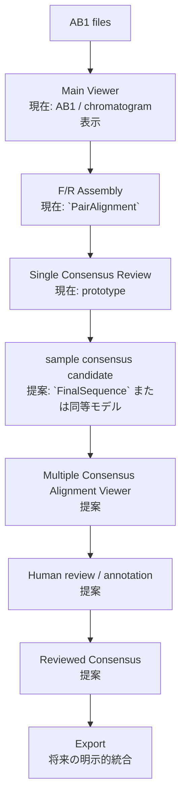
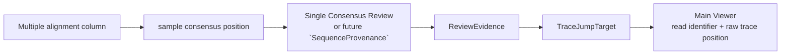
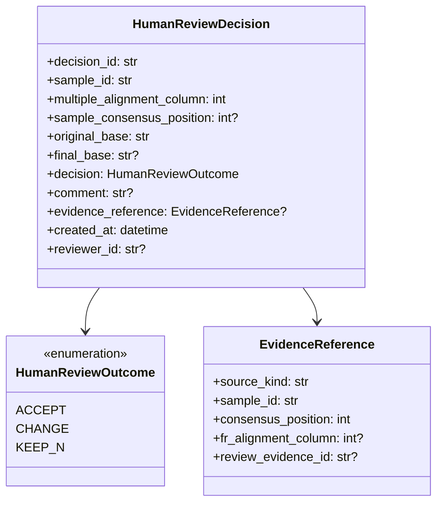
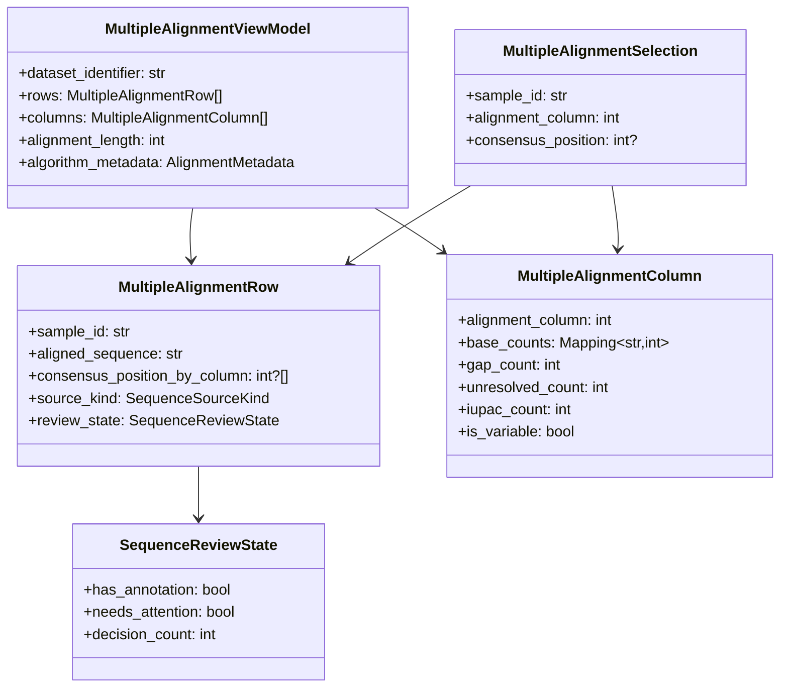

# Multiple Consensus Alignment Viewer 設計

## この文書の目的

この文書は、複数sampleのconsensus sequenceを整列して比較・reviewするための、`Multiple Consensus Alignment Viewer`の責務、座標契約、GUI設計、将来の人手判断の記録方法を定義する。

現在のコードを唯一の実装事実とする。現行コードには、1 sampleのpair consensusを扱う`SingleConsensusReviewWindow`、`ReviewEvidence`、`TraceJumpTarget`、およびMain Viewerへ座標を渡すcallbackが存在する。一方、複数sampleのconsensus collection、multiple consensus alignmentの生成・保持、`Multiple Consensus Alignment Viewer`、`HumanReviewDecision`、manual editの保存・export反映は**未実装の提案**である。

本書はconsensus algorithm、pair alignment、Review Engine、Main Viewer、既存出力を変更する仕様ではない。Single Consensus Reviewの詳細は[CONSENSUS_VIEWER_DESIGN.md](CONSENSUS_VIEWER_DESIGN.md)と[SINGLE_CONSENSUS_REVIEW_GUI_DESIGN.md](SINGLE_CONSENSUS_REVIEW_GUI_DESIGN.md)、pair consensusの責務は[CONSENSUS_V2_1_DESIGN.md](CONSENSUS_V2_1_DESIGN.md)を参照する。

## 1. Positioning

SangerFlowでは、同一sample内のF/R contig assemblyと、複数sample間のsequence比較を異なる処理として扱う。

| 画面・処理 | 対象 | 役割 | 行わないこと |
|---|---|---|---|
| Single Consensus Review | 1 sampleのForward / Reverse pair | F/R contigのbase decision、evidence、chromatogram座標を確認する。 | sample間の比較、multiple alignment、最終配列の確定。 |
| Multiple Consensus Alignment Viewer | 複数sampleのconsensus sequence | sample間の差異、variable site、gap、`N`、IUPACを比較し、人手reviewを支援する。 | F/R assembly、base calling、chromatogram描画、consensus algorithmの再計算。 |

`Multiple Consensus Alignment Viewer`は、MEGAやMesquite型の「sampleごとの配列を行、整列columnを列として読む」画面を目標とする。ただし、色やhighlightは確認補助であり、baseの生物学的正しさや最終採用を自動で決めるものではない。

### 重要な責務分離

```text
F/R Contig Assembly
  = 同一sample内のForward / Reverse readを統合する処理

Multiple Consensus Alignment
  = sampleごとのconsensus sequenceを比較する処理
```

F/R assemblyの`AlignmentColumn`と、multiple consensus alignmentのcolumnは意味が異なる。両者を同じ座標や同じデータ構造として扱ってはならない。

## 2. 現在の実装事実と提案範囲

### 実装済み

- `gui/consensus_viewer.py`の`SingleConsensusReviewWindow`は、1 sampleのv2.1 consensus candidateをCanvasで表示するprototypeである。
- 同windowはposition ruler、base選択、Review sites、Evidence panel、Forward / Reverse chromatogram jump callbackを提供する。
- `core/consensus_review_bridge.py`の`create_review_evidence()`は、`ConsensusV21Decision`と`PairAlignment`から`ReviewEvidence`を作る。
- `ReviewEvidence`の`TraceJumpTarget`は、read identifierとraw trace positionを保持する。
- `gui/main_window.py`は、読み込み済みreadから明確な`_F` / `_R` pairを選び、Single Consensus Reviewを起動できる。

### 未実装の提案

- pair / singleを共通に扱う解析用の確定sequence collection。
- 複数sample consensusのmultiple sequence alignment生成。
- Multiple Consensus Alignment Viewer本体。
- multiple alignment columnからsample consensus positionへ戻るmapping。
- human annotation、manual edit、`Reviewed Consensus`、履歴、exportへの明示的な反映。

`CONSENSUS_VIEWER_DESIGN.md`および`SINGLE_CONSENSUS_REVIEW_GUI_DESIGN.md`には、Single Consensus Review GUIやMain Viewer jumpを「未実装」とする既述がある。これは現在の`gui/consensus_viewer.py`、`gui/main_window.py`、`core/consensus_review_bridge.py`と矛盾する。本書ではコードを優先し、Multiple modeだけを未実装の提案として扱う。

## 3. Workflow

次の流れは、現行の実装済み経路と将来の提案経路を区別する。



### 運用上の意味

1. AB1を読み込み、必要なQCとtrimを行う。
2. 明確なF/R pairはassemblyし、Single Consensus Reviewで根拠と波形を確認する。
3. 各sampleから選択されたconsensus candidateを複数sample比較用の入力にする。
4. Multiple Consensus Alignment Viewerでsample間の差異を確認する。
5. 人間が判断を記録し、元のcandidateを上書きせずに`Reviewed Consensus`を派生させる。
6. exportは、どのsequence版を出力するかを明示してから行う。

single read由来のfinal candidateをこのworkflowへ含める共通`FinalSequence` / `SequenceProvenance`の設計は[PAIR_AND_SINGLE_WORKFLOW_DESIGN.md](PAIR_AND_SINGLE_WORKFLOW_DESIGN.md)の提案を参照する。現行コードでは未実装である。

## 4. UI設計案

### 4.1 全体レイアウト

```text
┌──────────────────────────────────────────────────────────────────────────┐
│ Multiple Consensus Alignment Viewer                                      │
│ Dataset: <name>   [Filter variable] [Filter N/IUPAC] [Show reviewed]     │
├──────────────────────────────────────────────────────────────────────────┤
│ position ruler: 1        10        20        30        40                 │
│               |---------|---------|---------|---------|                   │
│ Sample_001   A T G C T A G C T A ...                                     │
│ Sample_002   A T G C T A G T T A ...                                     │
│ Sample_003   A T G C T A G C T A ...                                     │
│                         ^ selected / variable column                     │
├───────────────────────────────┬──────────────────────────────────────────┤
│ Selected column / sample      │ Review / navigation                       │
│ alignment column              │ Open Single Consensus Review              │
│ sample consensus position     │ Forward / Reverse trace jump, if available│
│ base / state / annotation     │ Human decision and comment (future)       │
└───────────────────────────────┴──────────────────────────────────────────┘
```

最初のGUI実装は、Canvasまたはvirtualized tableなど、長いalignmentと多数sampleを扱える描画方式を選ぶ必要がある。個別のTk widgetを全baseへ作る方式は、大きなdatasetでの性能・操作性を検証してから採用可否を決める**検討候補**とする。

### 4.2 Sequence matrix

必須表示要素は次のとおりである。

- sample row: stableな`sample_id`、必要に応じてsequence source種別（pair / single / reviewed）を表示する。
- aligned consensus sequence: multiple alignment後のsequenceを等幅セルで表示する。
- position ruler: multiple alignment columnを1-basedで表示し、10 bp tickと50 bp major tickを用いる。
- selected column highlight: 現在選択中のcolumnを、色だけに依存しない太枠・縦線・labelで示す。
- variable site highlight: non-gapのbaseがsample間で複数種あるcolumnを視覚的に示す。
- gap、`N`、IUPAC: baseと区別可能に表示する。gapは`-`であり、missing evidenceや`N`と同一視しない。
- horizontal / vertical navigation: 長いsequenceと多数sampleを独立に移動できる。

### 4.3 Nucleotide color scheme

初期表示案は、現行Single Consensus Reviewと整合する次の配色である。

| 記号 | 背景色の提案 | 表示上の意味 |
|---|---|---|
| `A` | red | nucleotide `A` |
| `T` | blue | nucleotide `T` |
| `G` | yellow | nucleotide `G` |
| `C` | green | nucleotide `C` |
| `-` | neutral gray | alignment gap |
| `N` | gray | unresolved base |
| IUPAC | grayまたは黄灰色 | ambiguity code |

文字、罫線、selected outline、column label、tooltipまたはside panelを併用し、色だけでbase・状態・review優先度を伝えない。base種別の色と「人手reviewが必要」という状態色は別概念であり、重ねる場合も凡例を必須とする。

### 4.4 Selected column panel

行とcolumnを選択したとき、少なくとも次を表示する提案とする。

| 項目 | 内容 |
|---|---|
| `sample_id` | 選択rowのsample識別子。 |
| multiple alignment column | 0-based内部値と1-based表示値を明示する。 |
| aligned base | gapを含む、当該matrix cellの文字。 |
| sample consensus position | gapでなければ0-based内部値と1-based表示値。gapなら`None`。 |
| source kind | pair consensus、single-read final candidate、reviewed等。現行の共通モデルが未実装のため提案。 |
| variable-site summary | 当該columnのbase種別、gap数、`N` / IUPAC数。 |
| review state | annotationが存在するときだけ表示する将来値。 |

## 5. Coordinate systemとnavigation

### 5.1 座標の明確な分離

次の四種類の座標を、画面・API・保存形式で混同しない。

| 座標 | 範囲 | 意味 | gap時 |
|---|---|---|---|
| multiple alignment column | dataset全体 | 複数sample consensusを整列したcolumn。 | 常に存在する。 |
| sample consensus position | 1 sample | gapを除いた元consensus sequence内のposition。 | `None`。 |
| F/R alignment column | 1 pair sample | 同一sampleのForward / Reverse assembly内column。 | pair provenanceがあるときのみ存在する。 |
| raw trace position | 1 AB1 read | 元AB1 trace上のposition。 | 対応read / coordinateがないとき`None`。 |

内部indexは0-basedとし、UIで表示する番号は1-basedへ変換する。`end`を必要とする範囲はexclusiveとし、列番号と混同しない。

### 5.2 唯一のtraceability経路

multiple alignment columnはAB1波形座標を直接持たない。次の経路だけで元データへ戻る設計とする。



pair由来のsampleでは、Single Consensus Reviewが持つ`ReviewEvidence`を用いる。`ReviewEvidence`は既存`PairAlignment -> AlignmentColumn -> ReadCoordinate`から座標を読むため、Multiple Viewerはraw indexやtrace positionを再計算しない。

```text
multiple alignment column
  -> sample consensus position
  -> F/R alignment column
  -> ReviewEvidence
  -> TraceJumpTarget
  -> Main Viewer
```

single-read final candidateでは、上記のpair用`ReviewEvidence`をそのまま使えない。`SequenceProvenance`またはsingle-read用bridgeが未実装のため、trace jumpを無効にして「provenance unavailable」と明示する。座標を推測してjumpしてはならない。

### 5.3 navigation操作

1. 利用者がmatrixのsample cellを選択する。
2. Viewerはmultiple alignment columnとsample consensus positionを表示する。
3. provenanceがあるpair sampleでは`Open Single Consensus Review`を有効にする。
4. Single Consensus Reviewで`ReviewEvidence`を確認し、ForwardまたはReverseの`TraceJumpTarget`を選ぶ。
5. Main Viewer callbackへread identifierとraw trace positionだけを渡す。

Multiple ViewerはMain Viewerを直接importせず、Single Viewerと同様にGUI-neutralなcallbackまたはadapterに依存する。

## 6. Human review設計

Multiple Alignment Viewerはsample間の比較で気付いた疑義を、人間が明示的に残す中心画面とする。ただし、annotationの作成とsequenceの書換えは同一操作にしない。

### `HumanReviewDecision`（提案）



| フィールド | 責務 |
|---|---|
| `sample_id` | 判断対象sampleを特定する。 |
| `multiple_alignment_column` | 比較画面上で判断が発生した列を再現する。 |
| `sample_consensus_position` | gapでないときの元consensus position。gapは`None`。 |
| `original_base` | annotation時点のcandidate base。 |
| `final_base` | `CHANGE`時の明示的な変更先。`ACCEPT` / `KEEP_N`ではpolicyを定義してから保存する。 |
| `decision` | `ACCEPT`、`CHANGE`、`KEEP_N`。将来のenum拡張は互換性を検討する。 |
| `comment` | 波形、周辺alignment、実験情報に基づく人間の根拠。 |
| `evidence_reference` | Single Viewerや将来のprovenanceへ戻る参照。 |

`HumanReviewDecision`は提案モデルであり、現行のReview EngineのPASS / REVIEW / FAILを置き換えない。`ACCEPT`、`CHANGE`、`KEEP_N`はbase-levelの人手判断であり、sample-level statusではない。

## 7. Manual edit policy

### 禁止

- Original Consensus sequenceをGUI widget、Canvas、または`SangerRead`上で直接書き換えない。
- 複数sample alignmentの表示columnを編集して元consensus positionを推測しない。
- annotationだけを根拠にAB1 raw sequence、quality、trace位置、F/R alignmentを変更しない。

### 推奨する派生モデル

```text
Original Consensus
  + immutable HumanReviewDecision history
  -> Reviewed Consensus
```

`Reviewed Consensus`は、どのOriginal Consensus versionとどの`HumanReviewDecision`群から作られたかを保存する派生値とする。再現可能性のため、元sequence、変更前base、変更後base、decision、comment、reviewer、時刻、evidence referenceを保持する。

`KEEP_N`は、「根拠不足の`N`をbaseへ置換しない」ことを明示する判断として記録する。`CHANGE`は、`final_base`がA/C/G/T/IUPAC/`N`のどれを許すかを、波形確認済みbenchmarkと生物学的運用を確認してから別途仕様化する。現段階で自動変更を許可しない。

## 8. GUI用データモデル案

以下はGUI専用adapterであり、coreのscientific modelに選択状態を書き込まない**提案**である。



### モデルの責務

| モデル | 保持するもの | 保持しないもの |
|---|---|---|
| `MultipleAlignmentViewModel` | 表示用row / column、alignment metadata、選択対象への参照。 | AB1 trace配列、GUI widget、mutableなscientific sequence。 |
| `MultipleAlignmentRow` | `sample_id`、aligned consensus、column-to-consensus mapping、source種別。 | F/R座標の再計算結果。 |
| `MultipleAlignmentColumn` | variable / gap / `N` / IUPACの記述的集計。 | PASS / REVIEW / FAIL、生物学的解釈。 |
| `SequenceReviewState` | annotationの有無などのGUI表示用要約。 | Review Engineのstatusを変更する権限。 |
| `MultipleAlignmentSelection` | 現在選択したsampleとcolumn。 | 永続的なmanual edit。 |

`consensus_position_by_column`はmultiple alignmentのgapを`None`として保持する。全rowでaligned sequence長が同じこと、non-gapのmapが0から元consensus長まで連続することをadapter生成時に検証する。

## 9. Variable siteとreview優先順位

`is_variable`は表示用の記述的値とする。初期定義の提案は、当該multiple alignment columnでnon-gapかつunambiguousなA/C/G/Tが2種類以上存在する場合に`True`とする。

次は別々にfilterできるよう設計する。

- variable site: sample間のbase差異。
- gap-containing column: insertion / deletionまたはalignment不確実性の候補。
- `N` / IUPAC-containing column: unresolvedまたはambiguous evidenceの候補。
- annotated column: すでに人手判断がある箇所。
- provenance unavailable: Single Viewerまたはtraceへ戻れない箇所。

これらはreviewの優先順位を補助する情報であり、species identification、haplotype、系統関係、配列の正誤を自動判定しない。

## 10. Non-goals

この設計の初期実装対象外は次のとおりである。

- GUI実装。
- multiple alignment algorithmの実装またはMAFFT parameterの変更。
- manual editing、annotation永続化、`Reviewed Consensus`生成。
- FASTA、Excel / TSV、BLAST、project save / reloadへの統合。
- phylogenetic analysis、species identification、automatic variant calling。
- consensus v1 / v2 / v2.1、pair alignment、Review Engine、trim、AB1 readerの変更。
- raw trace、quality、base positionのコピー保存または再計算。

## 11. 段階的な実装順序（提案）

1. 共通の解析入力契約を確定する。pair consensusとsingle-read final candidateを同じcollectionで扱えるが、source種別とprovenanceの有無は失わない。
2. multiple alignment resultのimmutable adapterを設計する。row、column、gap-to-consensus mappingを単体テストする。
3. read-only matrix Viewerを実装する。sample row、ruler、選択、horizontal / vertical scroll、variable site表示だけを提供する。
4. Single Consensus Reviewへのread-only遷移を追加する。pair provenanceがあるcellだけを有効にする。
5. 波形確認済みのhuman annotationを別モデルとして保存・再読込する。
6. `Reviewed Consensus`を明示的に生成し、export対象の選択と監査情報を設計する。

各段階で既存の`SangerRead`、`PairAlignment`、`ConsensusV21Decision`、`ReviewEvidence`を破壊的に変更しない。科学的な変更、手動base editの許容範囲、alignment parameter、export採用規則は、代表AB1と人手確認済みbenchmarkを使って別途検証する。

## 12. 関連設計との整合性

- [CONSENSUS_VIEWER_DESIGN.md](CONSENSUS_VIEWER_DESIGN.md): 本書は同文書のMode Bを、Multiple Viewer固有の座標・annotation・manual edit policyへ詳細化する。
- [SINGLE_CONSENSUS_REVIEW_GUI_DESIGN.md](SINGLE_CONSENSUS_REVIEW_GUI_DESIGN.md): Single Viewerはpair evidenceとchromatogram確認を担い、Multiple Viewerはsample間比較を担う。
- [CONSENSUS_V2_1_DESIGN.md](CONSENSUS_V2_1_DESIGN.md): v2.1はpair columnのbase decisionを提供する。Multiple Viewerはそのalgorithmを変更せず、candidateと根拠を表示・追跡する。
- `ReviewEvidence` bridge: `create_review_evidence()`と`TraceJumpTarget`はpair由来columnの既存座標経路である。Multiple Viewerはこれらを再実装・再計算せず、Single Viewerを介して利用する。
- [PAIR_ALIGNMENT_MODEL_DESIGN.md](PAIR_ALIGNMENT_MODEL_DESIGN.md): F/R `AlignmentColumn`と`ReadCoordinate`は同一sample内の座標契約であり、multiple alignment columnとは別物である。
- [PAIR_AND_SINGLE_WORKFLOW_DESIGN.md](PAIR_AND_SINGLE_WORKFLOW_DESIGN.md): pair / single混在dataset、`FinalSequence`、`SequenceProvenance`の将来設計の基礎である。
- [DEVELOPMENT_RULES.md](DEVELOPMENT_RULES.md): raw sequence、quality、trace位置、trim座標を不整合にしないという開発制約に従う。

## 13. 重要な設計思想

- Multiple Viewerは「配列を自動的に正しくする」画面ではなく、**人間が比較し、根拠へ戻り、判断を記録する画面**である。
- F/R assembly、sample consensus、multiple consensus alignment、raw traceの座標を混同しない。
- visual highlight、confidence、variable siteは確認の優先順位であり、最終的な科学的結論ではない。
- 元のcandidate sequenceはimmutableに保ち、判断は`HumanReviewDecision`として追記し、`Reviewed Consensus`を派生させる。
- provenanceがない場合は、便利さのために座標を推測せず、未対応であることを明示する。

## 関連文書

- [Architecture.md](Architecture.md)
- [CURRENT_STATUS.md](CURRENT_STATUS.md)
- [CONSENSUS_VIEWER_DESIGN.md](CONSENSUS_VIEWER_DESIGN.md)
- [SINGLE_CONSENSUS_REVIEW_GUI_DESIGN.md](SINGLE_CONSENSUS_REVIEW_GUI_DESIGN.md)
- [CONSENSUS_V2_1_DESIGN.md](CONSENSUS_V2_1_DESIGN.md)
- [PAIR_ALIGNMENT_MODEL_DESIGN.md](PAIR_ALIGNMENT_MODEL_DESIGN.md)
- [PAIR_AND_SINGLE_WORKFLOW_DESIGN.md](PAIR_AND_SINGLE_WORKFLOW_DESIGN.md)
- [DEVELOPMENT_RULES.md](DEVELOPMENT_RULES.md)
- [AGENTS.md](../AGENTS.md)
