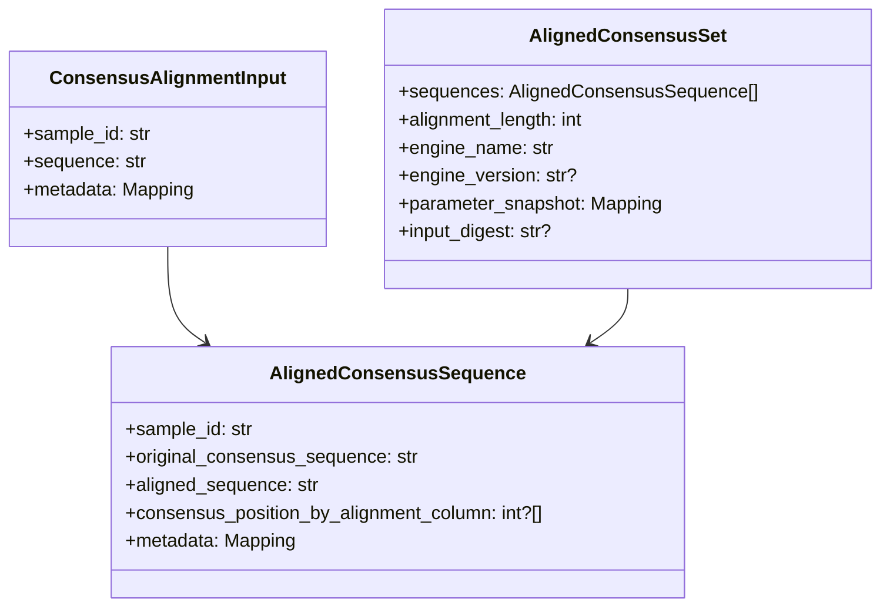
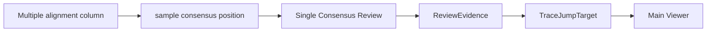

# Multiple Consensus Alignment Workflow 設計

## この文書の目的

この文書は、複数sampleのConsensus v2.1 candidate sequenceをMAFFT等でmultiple sequence alignmentし、`Multiple Consensus Alignment Viewer`へ渡して人間が比較・reviewする将来workflowを定義する。

現在のコードを唯一の実装事実とする。`core/consensus_v2_1.py`はpair consensus candidateを生成し、`gui/multiple_consensus_viewer.py`は**すでに整列済みで同一長のsequence**を表示するread-only prototypeである。一方、v2.1 consensus collection、consensus専用MAFFT module、`AlignedConsensusSet`、multiple alignmentの保存、人手判断の永続化、`Reviewed Consensus`、export統合は**未実装の提案**である。

本書はMAFFT実装、GUI、Consensus v2.1、Review Engine、exportを変更する仕様ではない。Multiple Viewerの画面設計は[MULTIPLE_CONSENSUS_ALIGNMENT_VIEWER_DESIGN.md](MULTIPLE_CONSENSUS_ALIGNMENT_VIEWER_DESIGN.md)、Single Reviewとの責務分離は[CONSENSUS_VIEWER_DESIGN.md](CONSENSUS_VIEWER_DESIGN.md)、pair candidateの判断契約は[CONSENSUS_V2_1_DESIGN.md](CONSENSUS_V2_1_DESIGN.md)を参照する。

## 1. Workflow定義

```mermaid
flowchart TD
    AB1["AB1"] --> Main["Main Viewer\nread / chromatogram確認"]
    Main --> Assembly["F/R Assembly\n`PairAlignment`"]
    Assembly --> Consensus["Consensus v2.1\n候補配列と根拠"]
    Consensus --> Single["Single Consensus Review\n波形とevidence確認"]
    Single --> Collection["Consensus sequence collection\n提案"]
    Collection --> MSA["Multiple Sequence Alignment\n提案: MAFFT等"]
    MSA --> Set["`AlignedConsensusSet`\n提案"]
    Set --> Viewer["Multiple Consensus Alignment Viewer"]
    Viewer --> Human["Human Review\n提案"]
    Human --> Reviewed["Reviewed Consensus\n提案"]
    Reviewed --> Export["Export\n将来の明示的統合"]
```

### 各段階の責務

| 段階 | 入力 | 出力 | 責務 |
|---|---|---|---|
| F/R Assembly | 同一sampleのForward / Reverse read | `PairAlignment` | 同一PCR産物由来readの座標対応を作る。 |
| Consensus v2.1 | `PairAlignment` | consensus candidateとdecision | pair columnのbase候補と根拠を作る。 |
| Single Consensus Review | candidate、`ReviewEvidence` | 人間の波形確認 | contigの根拠を確認する。baseを自動変更しない。 |
| Multiple Sequence Alignment | 複数sampleのcandidate sequence | aligned consensus sequence | sample間比較用の座標系を作る。 |
| Multiple Viewer | `AlignedConsensusSet` | 比較・review UI | variable site、gap、`N`等を表示する。alignmentを計算しない。 |
| Human Review | 表示・根拠 | 将来の`HumanReviewDecision` | 生物学的な妥当性を人間が判断する。 |

`Consensus v2.1`は「波形から作られた候補配列」、Multiple Sequence Alignmentは「sample間比較可能な座標系への変換」、Multiple Consensus Alignment Viewerは「人間が生物学的判断を行う画面」である。この三者の責務を混ぜない。

## 2. Alignment input specification

### 入力単位

alignment moduleへの入力は、AB1 raw readやF/R `AlignmentColumn`ではなく、**sampleごとに1本のv2.1 consensus sequence**とする。

```text
{
  "sample_id": "IK345",
  "sequence": "ATGCC...",
  "metadata": { ... }  # optional
}
```

| 項目 | 必須 | 意味 |
|---|---:|---|
| `sample_id` | 必須 | dataset内で一意かつstableなsample識別子。MAFFT input headerとaligned outputを対応させる。 |
| `sequence` | 必須 | gapを含まない入力consensus sequence。A/C/G/T、`N`、必要に応じてIUPACを許容する方針は専用moduleで明示する。 |
| `metadata` | 任意 | consensus algorithm version、source kind、生成日時、v1/v2.1比較情報、review状態等。sequence文字列の置換には用いない。 |

### 入力選択の前提

- v2.1は現時点ではshadow candidateであり、本番の最終sequenceへ自動昇格するものではない。
- alignment対象にするcandidateの選択（v1、v2.1、将来の`Reviewed Consensus`）は、datasetとalgorithm versionを明示して記録する**提案**である。
- single-read final candidateを将来同じcollectionへ含める場合も、`source_kind`とprovenance有無を失わない。詳細は[PAIR_AND_SINGLE_WORKFLOW_DESIGN.md](PAIR_AND_SINGLE_WORKFLOW_DESIGN.md)を参照する。
- `N`、IUPAC、low confidence、resolved conflictを入力前に自動置換・除去しない。

## 3. Alignment moduleの責務

### 提案する層分離

```text
core alignment module
  input: consensus sequence collection
  action: MAFFT等のmultiple sequence alignment実行と結果検証
  output: AlignedConsensusSet

gui
  input: AlignedConsensusSet
  action: matrix表示、選択、read-only navigation request

review
  input: 人間が確認した位置と根拠
  action: 将来の判断記録
```

ViewerやReview EngineへMAFFT起動、subprocess制御、FASTA一時入出力、alignment parameterを置かない。GUIは外部コマンドの標準出力や失敗を解釈しない。

### 現行実装との関係

`core/chromatogram_alignment.py`の`align_reads()`と`align_fasta()`はMAFFTを使用するが、前者は`SangerRead.trimmed_sequence`を入力とするread-level機能である。Consensus v2.1 sequenceを入力し、sample metadataとcolumn-to-consensus mappingを返す契約は現行コードにない。

したがって、将来のconsensus alignment moduleは既存関数を暗黙に流用せず、次を明示する専用adapterまたはmoduleとして設計する。

- 入力がsample consensusであること。
- input headerと`sample_id`を一意に復元できること。
- MAFFT出力のrow集合が入力sample集合と一致すること。
- aligned output rowから、gapを除いたoriginal consensus positionへ戻れること。
- parameter、MAFFT version、エラーをmetadataへ記録できること。

MAFFT以外のalignment engineを将来選ぶ場合も、`AlignedConsensusSet`の出力契約を保つ。engine選択やparameterは科学的・解析的判断を含むため、代表datasetと人手確認済みbenchmarkで検証してから決定する。

## 4. `AlignedConsensusSet` data model（提案）

`AlignedConsensusSet`は、original consensusとmultiple-aligned sequenceを同時に保持するimmutableな解析結果とする。GUI専用の選択状態、widget、review editは保持しない。



### `AlignedConsensusSequence`

| フィールド | 責務 | mutable |
|---|---|---:|
| `sample_id` | input / output rowを結ぶstable identifier。 | No |
| `original_consensus_sequence` | MAFFT入力前のgapなしcandidate。 | No |
| `aligned_sequence` | multiple alignment後のgapを含み得るrow。 | No |
| `consensus_position_by_alignment_column` | alignment columnからoriginal consensus positionへ戻るmap。gapは`None`。 | No |
| `metadata` | algorithm version、source kind、入力時の補足情報。 | No（値objectとして扱う） |

### `AlignedConsensusSet`

| フィールド | 責務 |
|---|---|
| `sequences` | input sampleと一対一対応するaligned rows。 |
| `alignment_length` | 全`aligned_sequence`に共通の長さ。 |
| `engine_name` | 例: `MAFFT`。実行engineを識別する。 |
| `engine_version` | 取得可能な場合の外部tool version。未取得なら`None`。 |
| `parameter_snapshot` | 実行時のoption等。設定を後から推測しないための記録。 |
| `input_digest` | 任意。入力collectionの同一性を確認するためのdigest。採用形式は将来決定する。 |

### mapping例

```text
multiple alignment column (0-based): 100

IK345 aligned row:     ... A - T ...
IK345 consensus map:   ... 98 None 99 ...

IK346 aligned row:     ... A G T ...
IK346 consensus map:   ... 100 101 102 ...
```

この例で、multiple alignment column `100`はIK345のoriginal consensus position `98`、IK346のposition `100`に対応する。columnの数値とsample内positionは同じ数になる保証がない。

## 5. Coordinate system

### 分離する四座標

| 種類 | 範囲 | 内部規約 | 意味 |
|---|---|---|---|
| A. multiple alignment column | dataset全体 | 0-based | 複数sample consensusを整列したcolumn。 |
| B. sample consensus position | 1 sample | 0-based | gapを除いたoriginal consensus内の塩基位置。 |
| C. F/R alignment column | 1 pair sample | 0-based | Forward / Reverse contig内の`PairAlignment` column。 |
| D. raw trace position | 1 AB1 read | 元AB1座標 | chromatogram上のpeak位置。sequence indexではない。 |

UIはA〜Cを1-basedで追加表示してよいが、内部値の意味と変換元を明示する。range endを扱う場合はexclusiveとする。

### navigation契約



pair sampleで、BからCへ進むには、sample consensus positionとSingle Reviewのdecision / F/R alignment columnとの対応が必要である。現行Single Viewerはpair consensus candidateを表示するが、multiple alignmentから呼び戻す統合は未実装である。

`ReviewEvidence`は既存の次の経路から作られる。

```text
F/R alignment column
  -> PairAlignment.AlignmentColumn
  -> ReadCoordinate
  -> raw trace position
  -> TraceJumpTarget
```

Multiple alignment moduleやViewerは、BからC/Dへの座標を再計算・推測してはならない。将来の`SequenceProvenance`または明示的なmapがないsampleでは、navigationを無効にして`provenance unavailable`と表示する。

## 6. Gap handling

MAFFT等が挿入したgapはmultiple alignment上の情報として保持する。

| 状態 | `aligned_sequence` | `consensus_position_by_alignment_column` | trace jump |
|---|---|---|---|
| sampleにbaseがあるcolumn | A/C/G/T/`N`/IUPAC | 対応する0-based position | provenanceがあれば可能 |
| MAFFT gap | `-` | `None` | 禁止 |
| sequence外の欠損 | moduleの明示的表現を要する | `None` | 禁止 |

gap columnに対して、前後のbaseやalignment位置からoriginal consensus positionを補間してはならない。gapは`N`、low quality、F/R internal gapとは異なる概念であり、UI・report・reviewで区別する。

## 7. Quality control（提案）

multiple alignment後に、moduleまたはdiagnostic reportが次の記述的情報を出せるようにする。

| 項目 | 意味 | 自動処置 |
|---|---|---|
| alignment length | output column数。 | 自動rejectしない。 |
| gap percentage | rowごと・columnごとのgap割合。 | 極端な値はreview候補として表示する。 |
| sequence identity | pairwiseまたは代表sequenceとのidentity。定義とgap扱いを明記する。 | species同定や正誤を自動決定しない。 |
| excessive divergence | length、gap、identity等の外れ値。 | 人間review対象として記録する。 |
| `N` / IUPAC割合 | unresolved / ambiguous symbolの割合。 | 自動置換・除外しない。 |

これらはalignmentの妥当性確認を支援する記述的metricsであり、PASS / REVIEW / FAILやdataset inclusionを自動で決めない。閾値は科学的に未確定であり、代表sampleと人手確認済みbenchmarkなしに固定しない。

## 8. Multiple Viewerとの接続

`Multiple Consensus Alignment Viewer`は`AlignedConsensusSet`を入力として、GUI表示用の`MultipleAlignmentViewModel`を生成するadapterを持つ提案とする。

```text
AlignedConsensusSet
  -> GUI adapter
  -> MultipleAlignmentViewModel
  -> MultipleConsensusAlignmentWindow
```

現行`gui/multiple_consensus_viewer.py`の`build_multiple_alignment_view_model()`は、`sample_id`と同一長の整列済み`sequence`を受け取るread-only adapterである。MAFFT実行、parameter解釈、sample candidateの選択、reviewの保存は行わない。

`tools/launch_multiple_consensus_viewer.py`の`--validation-known-pairs`は、6組のv2.1 candidateを末尾gapでpaddingする**表示確認用preview**を提供する。これは生物学的multiple alignmentではなく、`AlignedConsensusSet`の将来実装や解析入力として扱ってはならない。

詳細なmatrix UI、色、variable column、selection、callbackは[MULTIPLE_CONSENSUS_ALIGNMENT_VIEWER_DESIGN.md](MULTIPLE_CONSENSUS_ALIGNMENT_VIEWER_DESIGN.md)を参照する。

## 9. Human reviewとの関係

Multiple Viewerは、sample間の差異、gap、`N`、IUPAC、著しいdivergenceを人間が確認する画面である。waveform根拠が必要なpair sampleでは、Single Consensus Reviewを経由して`ReviewEvidence`とMain Viewerへ戻る。

manual editは、将来Multiple Viewerで開始できるようにするが、Original Consensusを直接変更しない。人手判断は将来の`HumanReviewDecision`として別に保存し、そこから`Reviewed Consensus`を派生させる位置付けとする。

今回、`HumanReviewDecision`の詳細データモデル、入力UI、永続化、edit適用、Review Engineへの反映は対象外である。詳細な基本方針は[MULTIPLE_CONSENSUS_ALIGNMENT_VIEWER_DESIGN.md](MULTIPLE_CONSENSUS_ALIGNMENT_VIEWER_DESIGN.md)を参照する。

## 10. Non-goals

本設計の今回の対象外は次のとおりである。

- MAFFTまたは他engineの実装・parameter確定。
- automatic quality filtering、automatic rejection、dataset exclusion。
- variant calling、species identification、phylogenetic analysis。
- manual editing、`HumanReviewDecision`の実装、`Reviewed Consensus`生成。
- FASTA / Excel / TSV export、BLAST、project save / reload統合。
- Consensus v1 / v2 / v2.1、pair alignment、Review Engine、Main Viewerの変更。
- gapからraw trace positionを推測する機能。

## 11. 段階的導入順序（提案）

1. v2.1 candidateと将来single final candidateを明示的なconsensus collectionへ集める。
2. `ConsensusAlignmentInput`と`AlignedConsensusSet`のimmutable契約を実装・テストする。
3. consensus専用alignment moduleを追加し、MAFFT input / output、sample ID、gap-to-position mapping、失敗時を検証する。
4. `AlignedConsensusSet`から既存Multiple Viewer prototypeへのadapterを追加する。
5. alignment QC reportとread-only review filterを追加する。
6. Single Viewerへのnavigationとprovenance availability表示を追加する。
7. 人間のannotationと`Reviewed Consensus`を別モデルとして設計・検証する。
8. export対象をOriginal / Reviewedのどちらにするかを明示的に選ぶworkflowを追加する。

各段階で、raw sequence、quality、trace位置、trim座標、F/R assembly座標を変更・上書きしない。MAFFT parameter、品質metrics、divergenceの扱い、manual editの許容範囲は、実験目的と波形確認済みbenchmarkを踏まえて人間が決定する。

## 関連文書

- [Architecture.md](Architecture.md)
- [CURRENT_STATUS.md](CURRENT_STATUS.md)
- [CONSENSUS_V2_1_DESIGN.md](CONSENSUS_V2_1_DESIGN.md)
- [CONSENSUS_VIEWER_DESIGN.md](CONSENSUS_VIEWER_DESIGN.md)
- [SINGLE_CONSENSUS_REVIEW_GUI_DESIGN.md](SINGLE_CONSENSUS_REVIEW_GUI_DESIGN.md)
- [MULTIPLE_CONSENSUS_ALIGNMENT_VIEWER_DESIGN.md](MULTIPLE_CONSENSUS_ALIGNMENT_VIEWER_DESIGN.md)
- [PAIR_ALIGNMENT_MODEL_DESIGN.md](PAIR_ALIGNMENT_MODEL_DESIGN.md)
- [PAIR_AND_SINGLE_WORKFLOW_DESIGN.md](PAIR_AND_SINGLE_WORKFLOW_DESIGN.md)
- [DEVELOPMENT_RULES.md](DEVELOPMENT_RULES.md)
- [AGENTS.md](../AGENTS.md)
