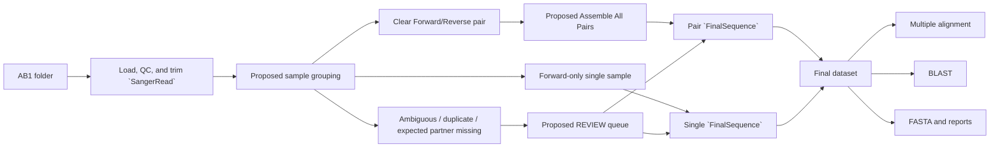
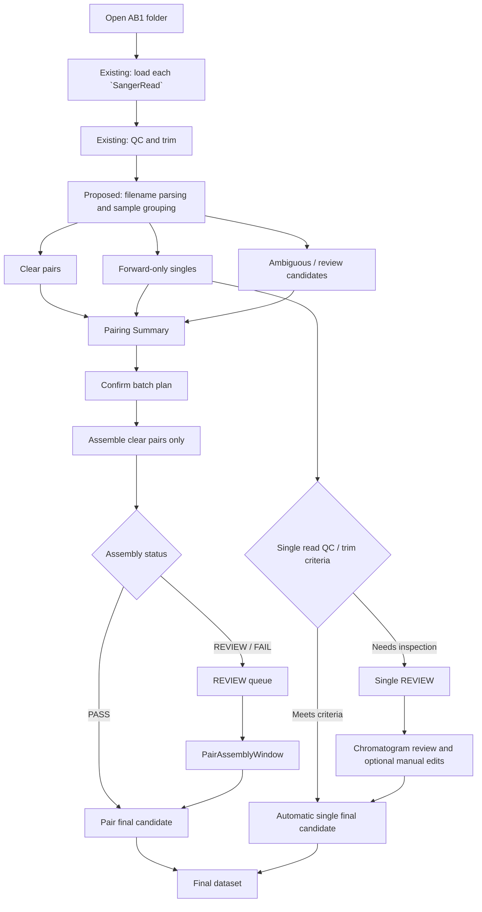
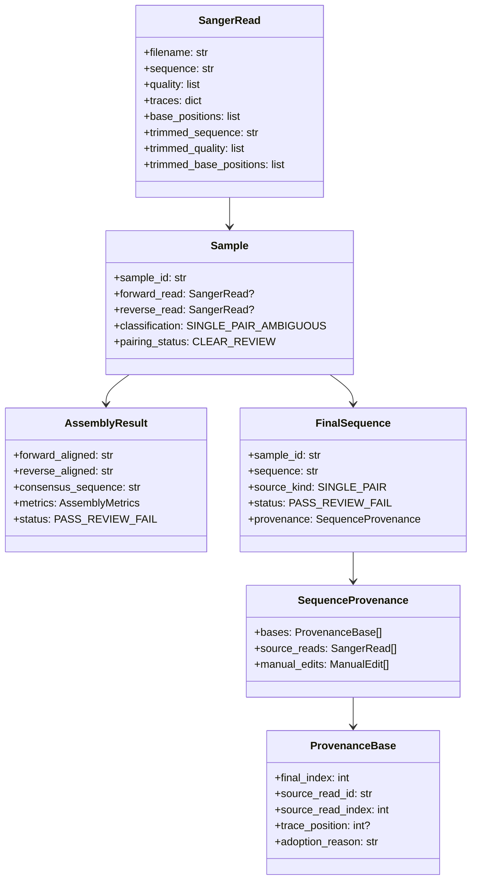
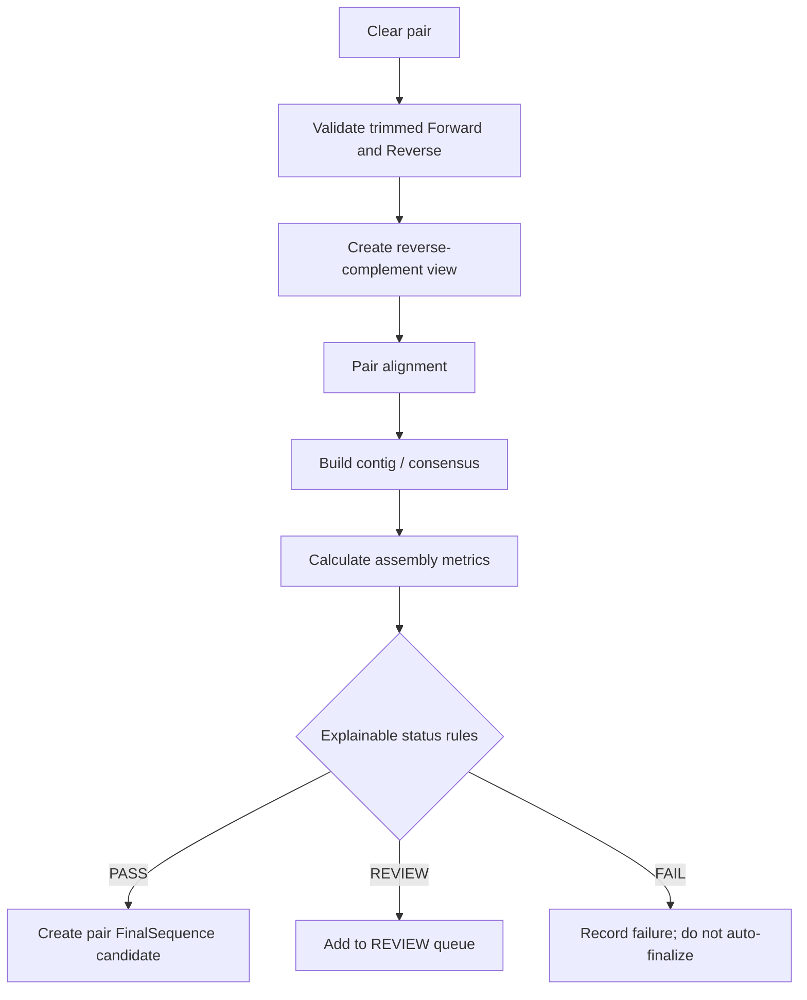
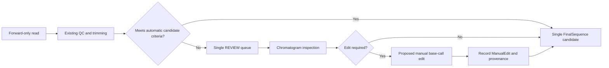
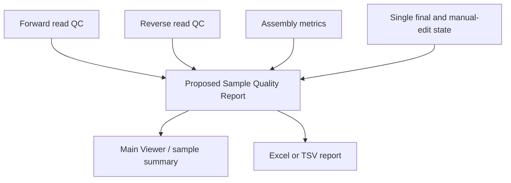
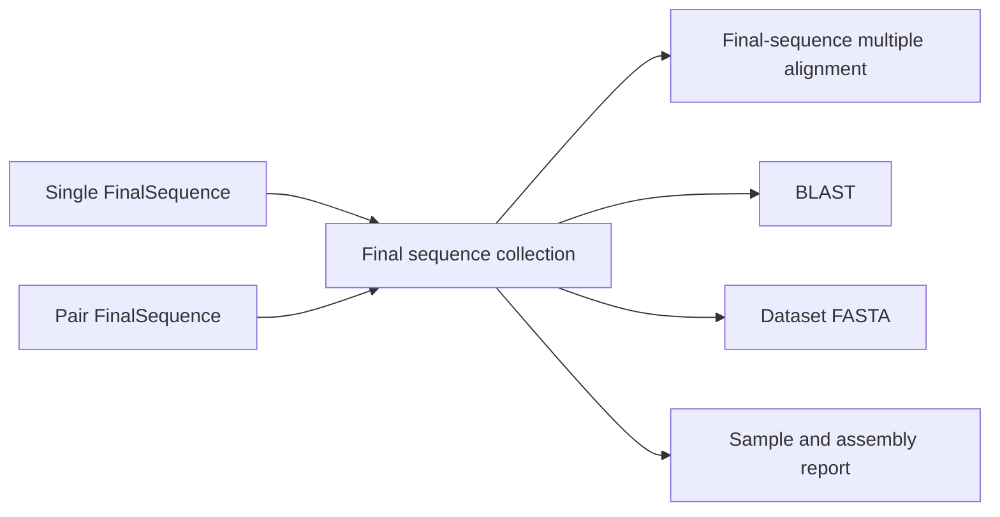

# Pair and Single Workflow Design Proposal

## この文書の目的

この文書は、Forward/Reverse readのcontig assemblyとForward-only single-read workflowが同じAB1フォルダに混在する利用を想定した、SangerFlowの正式な**設計提案**を記録する。

現在のコードを唯一の実装事実の基準とする。ここで示す `Sample`、`FinalSequence`、自動ペアリング、manual base-call edit、`PairAssemblyWindow`、REVIEW queue、assembly指標、および下流連携は、特記しない限り**未実装の提案**である。現在の実装状況は[CURRENT_STATUS.md](CURRENT_STATUS.md)、既存構造は[Architecture.md](Architecture.md)を参照する。

## 実装済み事項と提案事項

### 現在実装されている事項

- `SangerRead` はAB1由来の配列、品質値、波形、ピーク位置、トリム後データを保持する。
- Main Viewerは単一または複数readのクロマトグラム表示、トリム領域表示、read選択を行う。
- `AlignmentWindow` はトリム済みreadをMAFFTで整列し、整列列とトレース位置を対応付ける。
- `core/consensus.py` には多数決および品質加重コンセンサスがある。
- `core/exporter.py` にはread FASTAとconsensus FASTAの出力がある。
- `core/blast.py` は文字列配列をNCBI BLASTへ渡す。

### 未実装の事項

- Forward/Reverseの自動ペアリング。
- single sampleとpair sampleを表すsample単位のデータモデル。
- reverse-complementを考慮したpair assembly。
- contig assembly指標と `PASS` / `REVIEW` / `FAIL` 判定。
- manual base-call editと編集履歴。
- `FinalSequence` を共通入力とするdataset-level alignment、BLAST、export。
- REVIEW queueおよびREVIEW専用の `PairAssemblyWindow`。

## 設計目標

1. 明確なForward/Reverseペアを一括assemblyする。
2. Forward-only sampleを正常なsingle-read workflowとして扱う。
3. ambiguous、duplicate、または期待されたpartnerが欠落したsampleだけをREVIEWへ送る。
4. 最終datasetにはsampleごとに1つの `FinalSequence` を渡す。
5. 問題のあるpairだけを人間が詳細な波形確認を行う。
6. 既存のMain Viewer、`SangerRead`、read-level Alignment Viewerを可能な限り維持する。



## 1. フォルダ読込から最終dataset作成までのフロー

フォルダ読込後、各AB1は既存の `SangerRead` 読込、QC、トリミングを通る。提案するsample classifierがreadをsample単位へグループ化する。



single sampleは全件手動確認を前提にしない。既存のread QCとトリミングの基準を満たすものは、自動的にsingle `FinalSequence` の候補とする。read QCが `WARNING` / `FAIL`、トリム後配列が空または短すぎる、またはユーザーが確認を要求した場合だけREVIEWへ送る。具体的な基準値は科学的判断を伴うため、将来の設定として明示・記録する**提案**である。

## 2. PairとSingleが混在する場合のデータモデル

既存の `SangerRead` をpair状態や最終配列で過度に拡張しない。上位の派生モデルを追加する。



### `FinalSequence`

`FinalSequence` はdataset-levelの共通配列モデルである。

| 項目 | single sample | pair sample |
|---|---|---|
| `sequence` | trim・manual edit後の最終配列 | contig / consensus |
| `source_kind` | `SINGLE` | `PAIR` |
| 主な根拠 | read QC、トリム、波形確認、manual edit | overlap、conflict、coverage、consensus quality |
| 下流処理 | alignment、BLAST、FASTA export | alignment、BLAST、FASTA export |

### `SequenceProvenance`

`SequenceProvenance` は将来の波形同期に備える**提案**である。`FinalSequence` の各塩基について、少なくとも次を対応付ける。

| フィールド | 意味 |
|---|---|
| `final_index` | `FinalSequence.sequence` 内の位置 |
| `source_read_id` | 元のForwardまたはReverse readの識別子 |
| `source_read_index` | 元readのトリム後配列内の塩基index |
| `trace_position` | 元クロマトグラムのピーク位置。対応不能な場合は`None`。 |
| `adoption_reason` | 例: `single_trimmed`、`forward_supported`、`reverse_supported`、`quality_selected`、`manual_edit`、`unresolved` |

pair contigの1塩基がForwardとReverse双方に支持される場合は、1つの単純な値に潰さず、複数の `ProvenanceBase` を保持できる設計にする。manual editでは、元の支持情報を残した上で `adoption_reason=manual_edit` と編集記録を追加する。

### reverse readの不変性

reverse readの既存 `SangerRead.sequence`、`quality`、`traces`、`base_positions` は変更しない。assemblyでのみreverse-complement viewを生成する。

```text
assembly-oriented reverse index
    ↓
original trimmed index = length - 1 - assembly-oriented index
    ↓
`trimmed_base_positions[original trimmed index]`
    ↓
original chromatogram trace position
```

この対応は `SequenceProvenance` とassembly座標マップへ記録する提案である。

## 3. Main Viewerの表示案

Main Viewerは廃止しない。既存のクロマトグラム閲覧機能を保ち、sample単位の管理を段階的に追加する。

```text
┌─────────────────────────────────────────────────────────────────────┐
│ Open Folder | Detect Pairs | Pairing Summary | Assemble All Pairs    │
├──────────────────────┬──────────────────────────────────────────────┤
│ Samples              │ Existing Main Viewer                          │
│ ▾ Sample 001 [PAIR]  │ Forward / Reverse chromatogram display        │
│   ├ Forward [PASS]   │ Trim regions, zoom, pan, base selection       │
│   ├ Reverse [PASS]   ├──────────────────────────────────────────────┤
│   └ Contig [PASS]    │ Selected sample details                        │
│                      │ QC, assembly metrics, final status             │
│ ▾ Sample 002 [SINGLE]│                                              │
│   ├ Forward [PASS]   │                                              │
│   └ Final [PASS]     │                                              │
│ ▸ Sample 003 [REVIEW]│                                              │
└──────────────────────┴──────────────────────────────────────────────┘
```

提案するsample treeの状態バッジは以下である。

- sample種別: `PAIR` / `SINGLE` / `AMBIGUOUS`
- read QC: 現行の `PASS` / `WARNING` / `FAIL`
- assembly状態: `PASS` / `REVIEW` / `FAIL`
- final sequence状態: `DRAFT` / `PASS` / `REVIEW` / `EXCLUDED`

初期実装では、既存のフラットな `SamplePanel` を直ちに置き換えず、sample summaryのサイドパネルまたはダイアログを追加する方が安全である。

## 4. 自動ペアリング規則と曖昧時の処理

現在のコードにファイル名ペアリング規則はない。以下は設定可能な命名規則を導入する提案である。

```text
Sample_001_F.ab1       → sample_id=Sample_001, orientation=FORWARD
Sample_001_R.ab1       → sample_id=Sample_001, orientation=REVERSE
Sample_001_Forward.ab1 → sample_id=Sample_001, orientation=FORWARD
Sample_001_Reverse.ab1 → sample_id=Sample_001, orientation=REVERSE
```

| 条件 | 分類 | 一括assembly |
|---|---|---|
| 同一sample IDにForward 1件、Reverse 1件 | `PAIR / CLEAR` | 対象 |
| Forward 1件、Reverse 0件 | `SINGLE` または `REVIEW` | 対象外 |
| Forward 0件、Reverse 1件 | `REVIEW` | 対象外 |
| 同orientationが複数 | `AMBIGUOUS` | 対象外 |
| orientationを解析できない | `AMBIGUOUS` | 対象外 |
| sample IDの候補が衝突する | `AMBIGUOUS` | 対象外 |

### permissive policyとstrict policy

Forward-only sampleを正常に扱うため、既定はpermissive policyとする提案である。

```text
Forward 1件 + Reverse 0件
→ SINGLE
→ single-read QC / trim / finalization workflowへ送る
```

ただし、pair manifestまたは研究プロジェクト設定で「このsampleにはReverseが必須」と指定されている場合はstrict policyを使う。

```text
Expected Forward/Reverse pair + one side missing
→ REVIEW
```

この区別により、通常のsingle sampleを片側欠落として誤検出せず、明示的に期待されるpairの欠落だけをREVIEWへ送れる。

### 一括実行前の確認

`Assemble All Pairs` の前に、次の要約と一覧を表示する提案である。

```text
Detected pairs: 48
Single reads: 12
Ambiguous / review candidates: 3

[View pairs] [View singles] [View review candidates]
[Assemble 48 Clear Pairs] [Cancel]
```

## 5. `Assemble All Pairs` の処理

`Assemble All Pairs` はclear pairだけを対象にする。single sample、ambiguous sample、duplicate candidateは自動assemblyしない。



初期版では、独自の単一Confidence Scoreを導入しない。以下の説明可能な指標を個別に表示・保存する。

| 指標 | 意味 |
|---|---|
| `overlap_length` | ForwardとReverseが共にcoverageを持つ長さ |
| `overlap_identity` | overlap内の一致率 |
| `conflict_count` | overlap内の不一致塩基数 |
| `unresolved_base_count` | `N`など未解決塩基数 |
| `low_quality_consensus_base_count` | 設定した品質条件を満たさないconsensus塩基数 |
| `one_sided_coverage` | 一方のreadだけが支持する領域 |
| `per_base_consensus_quality` | 各consensus塩基の支持品質 |
| `status` | `PASS` / `REVIEW` / `FAIL` |

品質しきい値、overlap最小長、許容conflict数の決定は科学的判断を含む。初期実装では設定化し、使用値をreportへ記録する提案とする。

## 6. Single-read manual base-call workflow

現行Main Viewerにはchromatogram表示とトリム表示があるが、manual base-call editは未実装である。



manual editの設計原則は以下である。

1. `SangerRead.sequence`、品質値、波形、ピーク位置を直接書き換えない。
2. `FinalSequence` に対する変更として `ManualEdit` を記録する。
3. 最低限、位置、旧塩基、新塩基、理由、作業者、時刻を残す。
4. final塩基から元read indexとtrace positionへ戻れるようにする。

single sampleは、QC・trimが基準を満たせばmanual editなしでも自動final candidateになれる。manual確認は、問題のあるsampleまたは研究者が確認を要求したsampleに集中させる。

## 7. REVIEW queueと`PairAssemblyWindow`の役割

`PairAssemblyWindow` は、全pairを毎回確認する通常画面ではない。REVIEW状態または任意の詳細確認が必要なpairを開く専用画面とする提案である。

```text
Review Queue
────────────────────────────────────────────────────────────
Sample      Type       Reason                    Action
Sample_003  PAIR       4 conflicts               Open Review
Sample_009  PAIR       short overlap             Open Review
Sample_021  AMBIGUOUS  two reverse candidates    Resolve Pair
Sample_035  SINGLE     low terminal quality      Open Read
```

`PairAssemblyWindow` で表示する候補は以下である。

- Forward波形とbase call
- Reverse波形とreverse-complement assembly view
- overlap alignment
- contig / consensus
- conflict table
- per-base consensus quality
- overlap length、identity、conflict count、one-sided coverage
- 現在の `PASS` / `REVIEW` / `FAIL` 状態と理由

既存の `AlignmentWindow` は、複数sampleのfinal sequenceまたは必要なreadをクロマトグラムとともに比較する方向で維持する。pair assemblyの日常画面へ転用しない。

## 8. Quality Reportの拡張案

現行の `quality_report()` はread単位のlength、average quality、Q20、Q30を返し、`waveform_qc()` はread単位のQC状態を返す。これらを置き換えず、上位のsample-level reportを追加する。



### read QCは維持する

| sample | read | orientation | raw length | trim length | average Q | Q20 | Q30 | waveform QC |
|---|---|---|---:|---:|---:|---:|---:|---|

### sample summaryを追加する

| sample | sample type | final source | final status | include in dataset | review reason |
|---|---|---|---|---|---|

### pair sampleの追加列

| overlap length | overlap identity | conflict count | unresolved base count | low-quality consensus base count | one-sided coverage | assembly status |
|---:|---:|---:|---:|---:|---:|---|

### single sampleの追加列

| manual edit count | final sequence length | final status | review reason |
|---:|---:|---|---|

既存 `QualityPanel` はread品質の閲覧・選択用として維持する。初期段階ではsample summaryを別パネルまたは既存Excel出力の追加シートへ配置する方が、既存GUIを壊しにくい。

## 9. `FinalSequence` をAlignment、BLAST、Exportへ渡す設計



### Alignment

現行 `AlignmentWindow` は `SangerRead` とトレース対応を前提にしている。提案では次の入力を区別する。

| 入力 | 用途 |
|---|---|
| `SangerRead` | 現行のread-level chromatogram alignment |
| `FinalSequence` | sample-level final dataset alignment |

最小段階では `FinalSequence` のalignmentをsequence表示中心にし、波形同期は `SequenceProvenance` を使う将来拡張とする。これにより既存 `AlignmentWindow` の動作を直ちに変更しない。

### BLAST

既存の `blast_sequence(sequence)` は文字列を受け取る。提案するadapterは `FinalSequence.sequence` を渡し、結果へ `sample_id`、`source_kind`、`final_status` を記録する。標準対象は `PASS` final sequenceとし、`REVIEW`は利用者が明示的に選んだ場合だけ送る。

### Export

dataset用FASTAは採用済みの `FinalSequence` のみから生成する。

```text
>Sample_001
ACTG...

>Sample_002
ACTG...
```

pair/singleの由来、REVIEW理由、指標、編集履歴、設定値はFASTAヘッダーへ過剰に詰め込まず、Excel/TSV/JSONのreportへ保持する提案である。

## 10. 既存コードを壊さない段階的実装順序

### Phase 1: 分類とモデル

1. `SangerRead` を変更しない。
2. `Sample`、`FinalSequence`、`SequenceProvenance`、`AssemblyResult`、`AssemblyMetrics` を新設する。
3. filename parserとpermissive / strict pairing policyを追加する。
4. pair / single / ambiguous分類のテストを追加する。

### Phase 2: Main Viewerのsample管理

1. folder読込後にsample groupingを作る。
2. 既存 `SamplePanel` を置き換えず、sample summary表示を追加する。
3. `Pairing Summary` と開始前確認を追加する。
4. `Assemble All Pairs` はclear pairだけを対象にする。

### Phase 3: pair assemblyコア

1. reverse-complement viewとassembly座標マップを追加する。
2. pair alignment、contig生成、説明可能な指標を実装する。
3. `PASS` / `REVIEW` / `FAIL` を個別指標から判定する。
4. pair `FinalSequence` とprovenanceを生成する。

既存の `align_reads()` と `AlignmentWindow` はこの段階で変更しない。

### Phase 4: REVIEWとsingle finalization

1. REVIEW queueを追加する。
2. `PairAssemblyWindow` をREVIEW詳細確認用として追加する。
3. single sampleの自動final candidateとREVIEW振り分けを追加する。
4. manual base-call editと編集履歴を追加する。

### Phase 5: final dataset下流連携

1. `FinalSequence` collectionを追加する。
2. final dataset FASTA、sample report、assembly reportを追加する。
3. `FinalSequence` をBLASTとmultiple alignmentへ渡す。
4. `SequenceProvenance` を用いた波形同期を将来拡張として検討する。

## リスクと確認事項

- file namingだけではForward-only sampleと期待されたpairの片側欠落を完全には区別できない。permissive / strict policyとmanifestが必要である。
- reverse-complement時の品質・ピーク位置・波形座標の対応を誤ると、手動確認が誤誘導される。
- assembly statusのしきい値は科学的判断を含む。専門家の確認と設定値の記録が必要である。
- 現行の品質加重コンセンサスはpair assembly用の座標マップを持たないため、pair assemblyには専用実装が必要である。
- `FinalSequence` を既存Alignment Viewerへ直接渡すことは、現在のread・波形前提と一致しない。adapterまたは別のfinal-sequence表示経路が必要である。

## 関連文書

- [Architecture.md](Architecture.md)
- [CURRENT_STATUS.md](CURRENT_STATUS.md)
- [Roadmap.md](Roadmap.md)
- [DEVELOPMENT_RULES.md](DEVELOPMENT_RULES.md)
- [Workflow.md](Workflow.md)
- [PAIR_ASSEMBLY_ALGORITHM_DESIGN.md](PAIR_ASSEMBLY_ALGORITHM_DESIGN.md) — CAP3非依存のForward/Reverse contig assembly詳細設計
