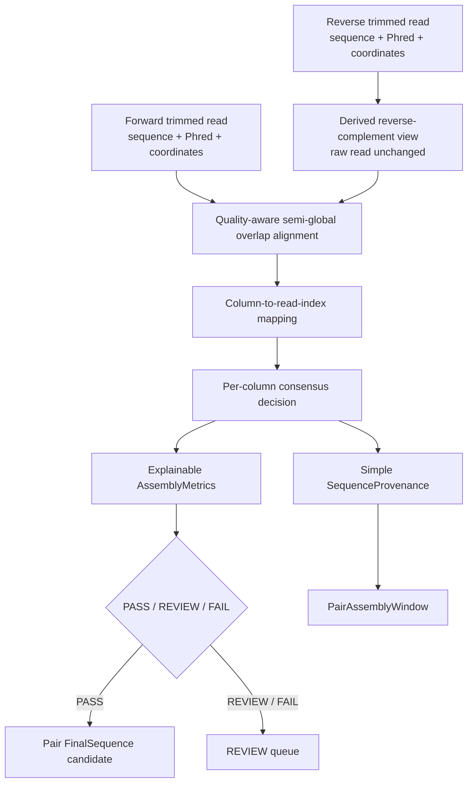
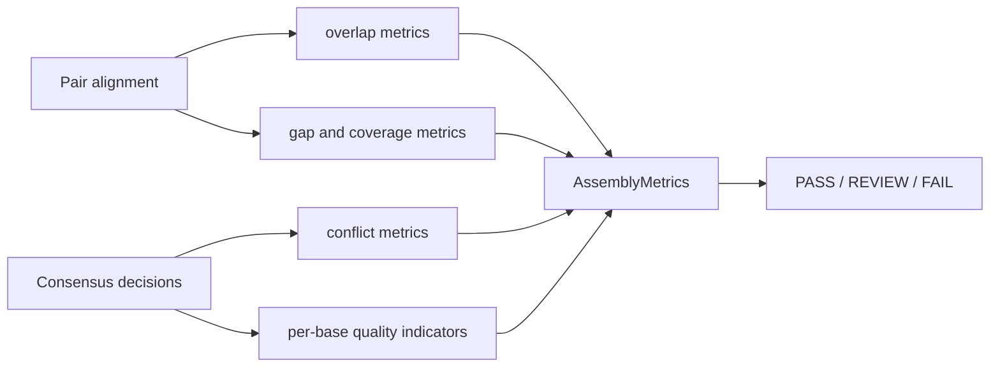
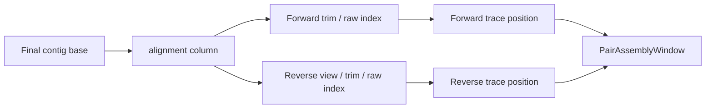
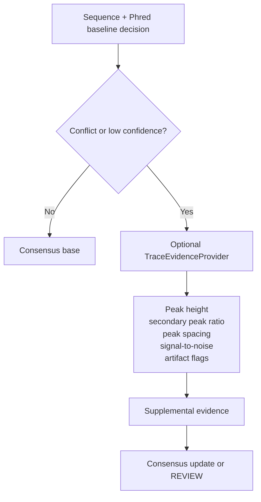

# SangerFlow Pair Assembly Algorithm Design

## この文書の目的

この文書は、CAP3に依存せず、同一PCR産物由来のForward / Reverse readを対象にSangerFlow内でcontigを生成する独自assemblyアルゴリズムの**設計提案**を定義する。

現在のコードを実装事実の唯一の基準とする。以下のpair assembly、quality-aware alignment、`AssemblyMetrics`、`SequenceProvenance`、REVIEW判定、波形評価は、特記しない限り**未実装の提案**である。現在の実装状況は[CURRENT_STATUS.md](CURRENT_STATUS.md)、single/pair workflowの上位設計は[PAIR_AND_SINGLE_WORKFLOW_DESIGN.md](PAIR_AND_SINGLE_WORKFLOW_DESIGN.md)を参照する。

## 実装済み事項と未実装の提案

### 現在実装されている事項

- `SangerRead` はAB1由来の配列、Phred quality、trace、peak位置、trim結果を保持する。
- `core/trimming.py` はtrim済み配列、品質、トリム後peak位置、トリム後traceを生成する。
- `core/chromatogram_alignment.py` はMAFFTによるread-level multiple alignmentを提供する。
- `core/alignment_mapper.py` はalignment列からトリム後trace位置への対応を作る。
- `core/consensus.py` には多数決と品質加重コンセンサスがある。
- `core/samples.py` はファイル名からclear pair、single、ambiguousを分類する。

### 未実装の提案

- reverse-complementを考慮した2-read専用pair assembly。
- semi-global overlap alignmentとcolumn-to-read-index mapping。
- assembly専用のPhred quality consensus。
- `AssemblyMetrics`、`AssemblyResult`、pair-specific `SequenceProvenance`。
- `PASS` / `REVIEW` / `FAIL` 判定とREVIEW queue。
- `PairAssemblyWindow` による詳細確認。
- waveform featureを用いた補助判定。

## 設計原則

1. raw `SangerRead` を変更しない。
2. 入力はtrim済み配列と、その品質値・座標対応とする。
3. pair assemblyは一般的なmultiple-read assemblyではなく、1 sampleあたり基本2 readに最適化する。
4. 塩基決定、quality、status、human reviewを別の概念として扱う。
5. 自動結果の各塩基は元read、index、trace位置、採用理由へ追跡可能にする。
6. GUIは判断ロジックを持たず、`core/` が返す結果と根拠を表示する。



## CAP3との比較

CAP3はquality valuesを利用できるassemblerである。原著では、quality valuesをoverlap計算、multiple alignment、consensus生成に利用し、Forward/Reverse constraintsも扱うと説明されている。 [Huang and Madan, 1999](https://pmc.ncbi.nlm.nih.gov/articles/PMC310812/)

| 観点 | CAP3 | SangerFlow独自方式の提案価値 |
|---|---|---|
| 主対象 | 一般的な複数read contig assembly | 同一PCR産物の基本2-read assembly |
| quality values | quality-aware overlap、alignment、consensusを利用 | Phredを各塩基決定・REVIEW理由へ明示的に残す |
| trace座標 | AB1 trace座標との内部対応は扱わない | final塩基から元readのpeak位置へ追跡可能 |
| provenance | 専用adapterが必要 | `SequenceProvenance` をassembly結果と同時に生成 |
| REVIEW | 出力後に別途解釈が必要 | conflict、gap、one-sided coverageをREVIEW queueへ直接送る |
| Single / Pair混在 | input assembly中心 | pair contigとsingle final sequenceを共通datasetへ統合 |
| GUI統合 | 外部実行・結果読込が必要 | Main Viewer、PairAssemblyWindow、FinalSequenceに内部統合 |
| 再現性 | external tool versionとparameter管理が必要 | algorithm version、criteria snapshot、decision reasonを保存 |

CAP3のquality利用は有用である。一方、SangerFlow独自方式の価値は、CAP3より良い一般assemblerを作ることではなく、AB1 trace座標、塩基provenance、REVIEW workflow、single/pair混在dataset、既存GUIとの内部統合を一貫して扱うことにある。

## アルゴリズム全体

```mermaid
flowchart LR
    A["Clear Forward/Reverse pair"] --> B["Validate trim result"]
    B --> C["Create reverse-complement view"]
    C --> D["Find candidate overlap"]
    D --> E["Semi-global pairwise alignment"]
    E --> F["Validate chosen overlap"]
    F --> G["Build alignment-column map"]
    G --> H["Generate consensus and provenance"]
    H --> I["Compute AssemblyMetrics"]
    I --> J["Assign PASS / REVIEW / FAIL"]
```



pair assemblyの入力は次である。

```text
Forward:
  trimmed_sequence
  trimmed_quality
  trim_start / trim_end
  trimmed_base_positions
  raw base_positions

Reverse:
  trimmed_sequence
  trimmed_quality
  trim_start / trim_end
  trimmed_base_positions
  raw base_positions
```

## Baseline v1

Baseline v1は、外部assemblerなしで説明可能な2-read contigを生成する最小の実装段階である。

### 1. Reverse-complement view

Reverse readのraw `SangerRead` は変更しない。assembly用に派生viewを作る。

```text
reverse_view.sequence = reverse_complement(reverse.trimmed_sequence)
reverse_view.quality  = reverse(reverse.trimmed_quality)
```

index対応を保存する。

```text
reverse_original_trim_index
  = reverse_trimmed_length - 1 - reverse_view_index

raw_read_index
  = reverse.trim_start + reverse_original_trim_index
```

### 2. Semi-global overlap alignment

Forwardとreverse-complement viewに対し、両read外側の非overlap端をfree-endとして扱うsemi-global alignmentを行う。

- overlap外のterminal gapは罰しない。
- overlap内のmatch、mismatch、gapはscoreへ入れる。
- internal gapとterminal gapを区別する。
- alignmentは各列についてForward / Reverseのtrim indexを返す。

Baseline v1では、候補探索は単純な全offsetまたは制約付きdynamic programmingでよい。read長が一般的なSanger read程度であり、2 readしか扱わないためである。

### 3. Column-to-read-index mapping

各alignment columnに次を保存する。

| フィールド | 説明 |
|---|---|
| `alignment_column` | 内部0-based column index |
| `forward_trim_index` | Forward塩基index。gapなら`None` |
| `forward_raw_index` | raw sequence index。gapなら`None` |
| `reverse_view_index` | reverse-complement view index。gapなら`None` |
| `reverse_trim_index` | 元Reverse trimmed index。gapなら`None` |
| `reverse_raw_index` | 元Reverse raw index。gapなら`None` |
| `final_index` | contig塩基が出力される場合のindex |

このmappingが、quality、trace、provenance、GUIクリック同期の基盤となる。

### 4. Phred qualityを用いたconsensus

各columnで観測されるbaseとPhred qualityを用いて、A/C/G/T候補を比較する。

Phred score `Q` から誤り確率の近似値を得る。

```text
e = 10^(-Q / 10)
```

真の塩基を `b`、観測塩基を `x` とする単純な観測モデルは次である。

```text
P(x | b, Q) = 1 - e   if x == b
P(x | b, Q) = e / 3   if x != b
```

Baseline v1は、この値を塩基決定の内部比較指標として利用する。**検証前の値を校正済みの確率、または臨床的・絶対的なconfidenceとして表示してはならない。**

GUI・reportに表示するのは、少なくとも次の説明可能な情報である。

- Forward base / Phred
- Reverse base / Phred
- 採用base
- 採用理由
- `N` の有無と理由
- per-base consensus quality indicator

### 5. Explainable `AssemblyMetrics`

Baseline v1は単一のConfidence Scoreを導入しない。

| 区分 | 指標 |
|---|---|
| overlap | `overlap_length`, `overlap_identity` |
| conflict | `conflict_count`, `resolved_conflict_count`, `unresolved_conflict_count` |
| gap / coverage | `internal_gap_count`, `terminal_gap_count`, `one_sided_coverage_count` |
| consensus | `contig_length`, `unresolved_base_count`, `low_quality_consensus_base_count`, `per_base_consensus_quality` |
| provenance | `algorithm_version`, `criteria_snapshot`, `status_reasons` |

### 6. `PASS` / `REVIEW` / `FAIL`

| 状態 | Baseline v1での意味 |
|---|---|
| `PASS` | 一意なoverlapがあり、設定した指標基準を満たし、未解決問題がないまたは許容範囲内。 |
| `REVIEW` | conflict、`N`、internal gap、大きなone-sided coverage、低品質塩基、曖昧なoverlapなどがある。 |
| `FAIL` | credible overlapがない、最低overlap条件に届かない、contigが空または基準を大きく下回る。 |
| `ERROR` | algorithm実行失敗、入力不正などの処理障害。科学的品質の`FAIL`とは別。 |

### 7. Simple `SequenceProvenance`

Baseline v1では、traceを複製せず、final塩基ごとにsourceへの参照を保持する。

```text
final_index
final_base
alignment_column
decision_reason
unresolved_reason
evidence[]
```

各evidenceは次を含む。

```text
read_id
orientation
raw_read_index
trimmed_read_index
raw_trace_position
trimmed_trace_position
source_base
source_quality
```

## Advanced future

以下はBaseline v1の検証後に検討する高度化である。いずれも未実装であり、最初のpair assemblyに必須ではない。

| 項目 | 提案内容 |
|---|---|
| k-mer候補探索 | seedからoffset候補を絞り、repeat由来の候補も比較する。 |
| posterior-based alignment scoring | alignment自体のscoreをquality-aware likelihood ratioへ発展させる。 |
| waveform feature解析 | peak高さ、secondary peak、spacing、signal-to-noise等をconflict評価へ使う。 |
| indel判定高度化 | internal gapをbase-call error、真のindel、heterozygosity候補として区別する。 |
| IUPAC ambiguity対応 | 混合templateやheterozygosityを扱うため、`N`以外のambiguity codeを検討する。 |

Advanced futureのPhred由来posteriorも、ベンチマークと校正が済むまでは「校正済み確率」として表示しない。表示時は `quality-aware decision indicator` のように、内部比較指標であることを明示する。

## Overlap決定

Baseline v1では、semi-global alignmentの結果から以下を評価する。

1. 両readがbaseを持つcolumn数を `overlap_length` とする。
2. overlap内のA/C/G/T一致率を `overlap_identity` とする。
3. terminal gapを除くinternal gapを数える。
4. overlap外の片側coverage区間を記録する。
5. 事前定義された基準により最良alignmentを採用する。

Advanced futureでは、k-mer候補、複数alignment候補のscore差、quality-aware likelihoodを用い、偶然の短い一致やrepeat内の誤ったoverlapをREVIEWへ送る。

## 塩基決定ルール

### 両readが同じbase

```text
Forward: A, Q35
Reverse: A, Q31
→ Consensus: A
→ decision_reason: both_agree
```

同じbaseでもqualityが低い場合はbaseを保持できるが、`low_quality_consensus_base_count` へ反映する。設定した基準を下回る場合はREVIEWまたは`N`候補とする。

### 異なるbaseでquality差が大きい場合

```text
Forward: A, Q18
Reverse: G, Q40
→ Consensus candidate: G
→ decision_reason: higher_quality_reverse
→ conflict_count: +1
```

Reverse `G` が明確に優勢な内部指標を示すため、candidateは`G`とする。ただしconflict自体は記録する。低品質側が事前定義された低品質条件を満たし、結果が十分明確である場合のみ自動PASS候補とする。それ以外はREVIEWへ送る。

### quality差が小さい場合

```text
Forward: A, Q31
Reverse: G, Q29
→ Consensus: N
→ decision_reason: unresolved_quality_conflict
→ status: REVIEW
```

高品質同士または近いqualityの不一致は、quality差だけで自動解決しない。

### 両方低品質で異なる場合

```text
Forward: A, Q9
Reverse: G, Q11
→ Consensus: N
→ decision_reason: low_quality_conflict
→ status: REVIEW
```

### 片側only coverage

```text
Forward:  ACTGACCTG
Reverse:      ACCTGTT
```

片側only領域は、source baseが品質基準を満たせばcontigへ含める。`one_sided_coverage` としてprovenanceへ記録し、一律に`N`へ置き換えない。

### `N` の基準

`N` は「最終塩基を説明可能に決められない」場合に限定する。

- 高品質Forward / Reverse conflict
- quality差が小さいconflict
- 両側低品質のconflict
- internal decision indicatorが基準未満
- reviewerがunknownを選んだ場合
- ambiguous alignment由来でbaseの出所が確定できない場合

`N` の理由は `unresolved_reason` に保存する。

```text
forward_reverse_conflict
low_quality_conflict
insufficient_decision_margin
ambiguous_alignment
manual_unresolved
```

## Gapとindel

| 状況 | Baseline v1の扱い |
|---|---|
| terminal gap | one-sided coverageとして記録し、qualityが十分ならbaseを保持する。 |
| internal gap +低品質側 | base候補を保持可能だがREVIEW理由にする。 |
| internal gap +高品質側 | indelまたはbase-call問題としてREVIEWにする。 |
| gap-only column | final sequenceには出力しない。 |

Baseline v1では、internal indelを自動で生物学的variantと断定しない。高度なindel判断はAdvanced futureとする。

## `AssemblyMetrics` とstatus判定



statusは単一scoreではなく、criteria snapshotに含まれる複数条件で決める。

```text
PASS:
  unique acceptable overlap
  acceptable identity and overlap length
  no unresolved bases beyond allowed limit
  no unacceptable internal gap / one-sided coverage

REVIEW:
  any conflict, N, internal gap, uncertain overlap,
  low-quality consensus base, or material one-sided coverage

FAIL:
  no credible overlap, invalid / empty contig,
  or criteria clearly outside permitted limits

ERROR:
  processing failure; separate from scientific quality failure
```

閾値は対象遺伝子、read長、primer、実験条件に依存するため、コードへ固定せず設定化し、使用値を結果に残す必要がある。

## `SequenceProvenance` とPairAssemblyWindow



`PairAssemblyWindow` は全pairを確認する通常画面ではなく、REVIEWまたは任意の詳細確認用である。最低限、以下を表示する。

- sample、read名、read QC、trim範囲
- Forward配列・Reverse-complement assembly view
- pair alignmentとcontig
- overlap length、identity、conflict count、gap count、one-sided coverage
- 選択baseのForward / Reverse base、Phred、trace位置
- consensus decision reason、`N` reason、manual decision
- per-base quality indicator

## 将来の波形形状評価

waveform featureはBaseline v1のoverlap決定には使用しない。sequenceとPhredによるbaseline結果を保持したうえで、conflict解決またはREVIEW優先度付けに追加する。



`TraceEvidenceProvider` は次を返す提案である。

- called peakとsecond-highest channelの比
- peak高さ・幅・spacing
- double peak、saturation、dye blobなどのartifact候補
- trace由来のsupport / caution reason

波形が塩基決定を変える場合、sequence/Phredだけのbaseline decision、trace feature、変更後のreasonをすべて保存する。

## 実装段階

### Baseline v1

1. reverse-complement view
2. semi-global overlap alignment
3. column-to-read-index mapping
4. Phred qualityを用いたconsensus
5. explainable `AssemblyMetrics`
6. `PASS` / `REVIEW` / `FAIL`
7. simple `SequenceProvenance`

### Advanced future

1. k-merによる候補探索
2. posterior-based alignment scoringの高度化
3. waveform feature解析
4. indel判定の高度化
5. IUPAC ambiguity対応

## アーキテクチャ整合性

この設計は[Architecture.md](Architecture.md)、[DataModel.md](DataModel.md)、[PAIR_AND_SINGLE_WORKFLOW_DESIGN.md](PAIR_AND_SINGLE_WORKFLOW_DESIGN.md)、[DEVELOPMENT_RULES.md](DEVELOPMENT_RULES.md)と整合する。

- algorithmはGUIではなく `core/` に置く。
- `SangerRead` のraw情報を変更しない。
- trim後sequence・quality・座標を使用する。
- pair assemblyはread-level MAFFT alignmentを置換しない。
- `FinalSequence` とdataset integrationはpair/single共通の下流境界とする。
- statusと根拠を分離し、科学的しきい値をAIだけで確定しない。

実装前には、human-reviewed pairおよび既知referenceを含むbenchmarkを作り、overlap、conflict、gap、`N`、one-sided coverageの期待結果をテストとして固定する必要がある。

## 関連文書

- [Architecture.md](Architecture.md)
- [DataModel.md](DataModel.md)
- [CURRENT_STATUS.md](CURRENT_STATUS.md)
- [PAIR_AND_SINGLE_WORKFLOW_DESIGN.md](PAIR_AND_SINGLE_WORKFLOW_DESIGN.md)
- [Roadmap.md](Roadmap.md)
- [DEVELOPMENT_RULES.md](DEVELOPMENT_RULES.md)
