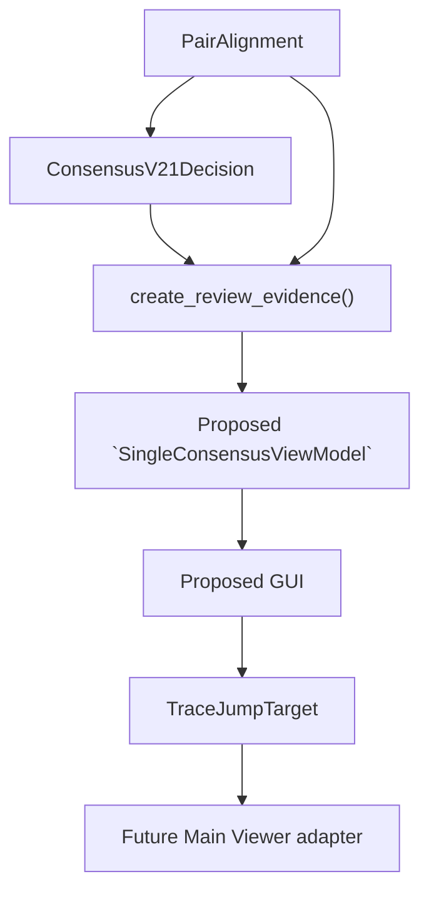
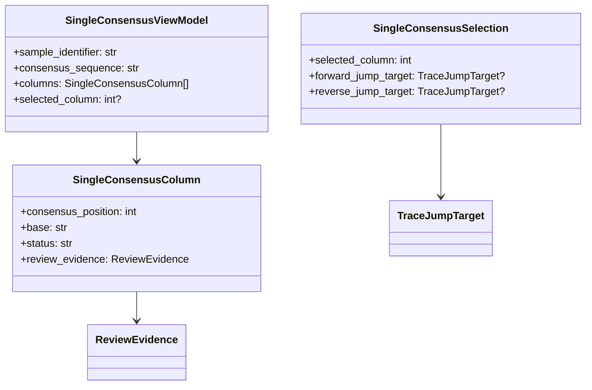

# Single Consensus Review GUI 設計

## この文書の目的

この文書は、[CONSENSUS_VIEWER_DESIGN.md](CONSENSUS_VIEWER_DESIGN.md)のMode AであるSingle Consensus Reviewを、最初にGUI化するための設計を定義する。Single Consensus Reviewは、1 sampleのForward / Reverse contig結果を確認し、各consensus baseの判断根拠から元AB1 chromatogramへ追跡するreview interfaceである。

現在のコードを唯一の実装事実とする。`PairAlignment`、Consensus v2.1 shadowの`ConsensusV21Decision`、`ReviewEvidence`、`TraceJumpTarget`、Main Viewer Coordinate Inspectorは存在する。一方、Single Consensus Review GUI、view model、Main Viewerへの実際のjump adapterは**未実装の提案**である。

pair consensusの責務は[CONSENSUS_V2_1_DESIGN.md](CONSENSUS_V2_1_DESIGN.md)、bridgeの座標契約は[CONSENSUS_VIEWER_DESIGN.md](CONSENSUS_VIEWER_DESIGN.md)と[PAIR_ALIGNMENT_MODEL_DESIGN.md](PAIR_ALIGNMENT_MODEL_DESIGN.md)、開発制約は[DEVELOPMENT_RULES.md](DEVELOPMENT_RULES.md)を参照する。

## 1. Positioning

Single Consensus Reviewの役割は次の三つである。

- 1 sampleのconsensus sequenceを閲覧する。
- 各baseのdecision evidenceを閲覧する。
- 必要なbaseから既存Main Viewerのchromatogram位置へ戻る。

この画面は、completed sequenceを単に表示する画面ではない。**Consensus判断を元データへ追跡するreview interface**として設計する。

### 対象外

- chromatogram traceの描画。
- base calling、F/R pair alignment、consensus algorithmの計算。
- manual edit、automatic acceptance、automatic rejection。
- PASS / REVIEW / FAILの変更。
- export、BLAST、dataset inclusionへの反映。

## 2. UI layout案

最初のprototypeは次の3領域で構成する提案とする。

```text
┌───────────────────────────────────────────────────────────────────┐
│ Sample: Sample_001                         [Close]                 │
├───────────────────────────────────────────────────────────────────┤
│ Consensus sequence panel                                          │
│ Position:   1   2   3   4   5   6   7                              │
│ Sequence:   A   T   G   C   N   A   T                              │
├───────────────────────────────┬───────────────────────────────────┤
│ Evidence panel                │ Navigation panel                  │
│ Selected base and F/R data    │ [Open Forward chromatogram]       │
│                               │ [Open Reverse chromatogram]       │
└───────────────────────────────┴───────────────────────────────────┘
```

### Consensus sequence panel

表示する情報は次のとおりである。

- sample name。
- consensus sequence。
- position number。
- baseごとのstatus label。

初期の表示案は以下である。

| 状態 | 色の補助表示 | 代表例 |
|---|---|---|
| 通常 | 白 | 継承された非問題column。 |
| two-sided agreement | 緑 | `TWO_SIDED_AGREEMENT`。 |
| higher-quality side selected | 黄 | `HIGHER_QUALITY_FORWARD` / `HIGHER_QUALITY_REVERSE`。 |
| unresolved conflict / insufficient evidence | 赤 | `UNRESOLVED_CONFLICT` / `INSUFFICIENT_EVIDENCE`。 |
| consensus base `N` | 灰 | `N`、IUPAC由来の未解決等。 |

色は唯一の情報源にしない。各baseにstatus text、tooltip、またはaccessible nameを付け、decision reasonとconfidenceをEvidence panelで必ず表示する。色覚多様性を考慮して、色だけで状態を伝えない。

baseをクリックすると、そのconsensus positionを選択する。

## 3. Evidence panel

選択baseについて、Evidence panelには少なくとも次を表示する。

### Basic

- sample identifier。
- consensus position。
- consensus base。
- decision reason。
- evidence context。
- confidence level。これは絶対確率ではなく、内部の定性的labelである。
- selected source（`FORWARD`、`REVERSE`、`BOTH`、`NONE`）。
- v1 base。利用可能な比較結果がある場合だけ表示する。

### Forward evidence

- base。
- quality。
- raw index。
- trimmed index。
- raw trace position。
- trimmed trace position。
- read identifier。

### Reverse evidence

Forwardと同じ項目を表示する。

gap側またはcoordinate unavailable側は、座標を推測しない。`None`または「unavailable」と表示し、該当chromatogram buttonを無効にする。

## 4. Navigation

Navigation panelには次のbuttonを置く提案とする。

- `Open Forward chromatogram`
- `Open Reverse chromatogram`

各buttonは、既存coreの座標経路だけを使う。

```text
ReviewEvidence
    -> TraceJumpTarget
    -> Main Viewer adapter
    -> Main Viewer
```

Main Viewer adapterへ渡す情報は次の二つに限定する。

- `read_identifier`
- `raw_trace_position`

既存Main Viewerはread filenameとraw trace positionを用いて対象readを選び、既存Coordinate Inspectorと整合する位置を表示する。GUIはraw index、trimmed index、またはassembly indexからtrace positionを再計算してはならない。

## 5. Data flow

Single Consensus Reviewのdata flowは次のとおりである。



`create_review_evidence()`は、`PairAlignment -> AlignmentColumn -> ReadCoordinate`から既存座標を読む。`SingleConsensusViewModel`やGUIがbase、quality、trace位置を独自に生成・補正してはならない。

## 6. GUI adapter model

次のview modelは未実装の提案である。GUIの選択状態をcore scientific dataと分ける。



| モデル | 責務 |
|---|---|
| `SingleConsensusViewModel` | 1 sampleの表示用sequence、column一覧、現在の選択を保持する。 |
| `SingleConsensusColumn` | 1 consensus positionのbase、GUI用status、対応する`ReviewEvidence`への参照を保持する。 |
| `SingleConsensusSelection` | 選択columnと、利用可能なForward / Reverse jump targetを保持する。 |

`status`は色・icon・filterに使うGUI専用の派生情報であり、`ConsensusV21Decision.decision_reason`を置き換えない。coreの`SangerRead`、`PairAlignment`、`ConsensusV21Decision`へGUI状態を書き込まない。

## 7. User workflow

想定する利用者workflowは次のとおりである。

1. AB1を読み込む。
2. Forward / Reverse contigを生成する。
3. Single Consensus Reviewを起動する。
4. 怪しいbase、`N`、conflict、v1/v2.1差分をクリックする。
5. Evidence panelでForward / Reverse evidenceと座標を確認する。
6. `Open Forward chromatogram`または`Open Reverse chromatogram`でMain Viewerへ移動する。
7. 波形を確認する。

このworkflowはhuman reviewを支援する。画面操作だけでconsensusを承認、書換え、exportしてはならない。

## 8. First prototype scope

最初の実装では、次だけを必須範囲とする。

- 1 sampleのconsensus sequence表示。
- base selection。
- `ReviewEvidence`に基づくEvidence panel表示。
- 利用可能な`TraceJumpTarget`を使うMain Viewer jump request。

次は後回しにする。

- editing、manual base-call correction。
- annotationと履歴保存。
- multiple consensus alignment mode。
- Review Engine結果の編集または変更。
- export、BLAST、dataset integration。
- chromatogramの再描画またはtrace同期描画。

## 9. Non-goals

Single Consensus Reviewの初期prototypeは、以下を行わない。

- consensusの自動修正。
- consensus、alignment、trimming、quality threshold、Review Engineのalgorithm変更。
- chromatogramの再描画、編集、traceデータのコピー保存。
- automatic acceptance、PASS / REVIEW / FAILの変更。
- v2.1 shadow結果の本番sequenceへの自動反映。

## 関連文書

- [CONSENSUS_VIEWER_DESIGN.md](CONSENSUS_VIEWER_DESIGN.md)
- [CONSENSUS_V2_1_DESIGN.md](CONSENSUS_V2_1_DESIGN.md)
- [PAIR_ALIGNMENT_MODEL_DESIGN.md](PAIR_ALIGNMENT_MODEL_DESIGN.md)
- [PAIR_ASSEMBLY_ALGORITHM_DESIGN.md](PAIR_ASSEMBLY_ALGORITHM_DESIGN.md)
- [PAIR_AND_SINGLE_WORKFLOW_DESIGN.md](PAIR_AND_SINGLE_WORKFLOW_DESIGN.md)
- [DEVELOPMENT_RULES.md](DEVELOPMENT_RULES.md)
- [AGENTS.md](../AGENTS.md)
